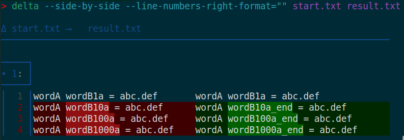

**Exercises** to learn [vim-visual-multi](https://github.com/mg979/vim-visual-multi).

A complement to the official [tutorial](https://github.com/mg979/vim-visual-multi#tutorial).

**How to use**

0. Read [doc/visual-multi.txt](https://github.com/mg979/vim-visual-multi/blob/master/doc/visual-multi.txt) and practice with [doc/vm-tutorial](https://github.com/mg979/vim-visual-multi/blob/master/doc/vm-tutorial).
1. Read the [`C-Down`/`C-Up` to add cursors vertically](#c-downc-up-to-add-cursors-vertically) exercise to get familiar with VM (short for [vim-visual-multi](https://github.com/mg979/vim-visual-multi)). This is the most beginners-focused exercise and has screenshots.
2. [Learning by Doing](https://en.wikipedia.org/wiki/Learning-by-doing). Go to an [exercise](#exercises) and try to solve it:
- Make the left window buffer become identical to the right one applying VM commands: `cd <this_repo>/exercises/<exercise_name> && vim -d start.txt result.txt` or directly copy-paste the command of *Start vs result* section of the desired exercise.
- To display the solution click on `▸ Solution` or use `:split steps.md`.
3. To solve the exercises more programmatly read the [Transpose programmatly](#transpose-programmatly) exercise as example.
4. All collaboration is appreciated: [contribute](#contribute).

<a id="avoid_VM_wiki"></a>**Avoid VM wiki, embrace `:help vm-`**

Use `:help vm-quick-reference` or alike to read the up-to-date VM own documentation. The [wiki](https://github.com/mg979/vim-visual-multi/wiki) will be kept for screenshots but consider it outdated for everything else.

**leader- vs \\\\**

`leader-` is your `g:VM_leader` (default `\\`)
- In section's headers it appears as `leader-` instead of `\\` because one might not use the default `g:VM_leader`.
- But the other way around in solutions to make it easier to understand (and apply) for Vim-beginners. Also to not confuse with Vim-mapleader (see `:help mapleader`).

<a id="exercises"></a>**Exercises**

* [`C-Down`/`C-Up` to add cursors vertically](#c-downc-up-to-add-cursors-vertically)
  * [Compare-results](#add-cursors-vertically-compare-results)
* [`leader-c` to add cursors vertically](#leader-c-to-add-cursors-vertically)
* [`Q` to remove unwanted cursors after selection](#q-to-remove-unwanted-cursors-after-selection)
* [`q` to skip cursor-region and go to next region](#q-to-skip-cursor-region-and-go-to-next-region)
* [`.` to run single repeat](#dot-to-run-single-repeat)
  * [Dot to add content](#dot-to-add-content)
  * [Dot to remove content](#dot-to-remove-content)
* [`R` to replace content of pattern](#r-to-replace-content-of-pattern)
* [`leader-\` to add cursor at position](#leader-backslash-to-add-cursor-at-position)
* [`leader-d` to duplicate regions](#leader-d-to-duplicate-regions)
* [`leader-t` to transpose](#leader-t-to-transpose)
  * [Transpose programmatly](#transpose-programmatly)
* [Rotate programmatly](#rotate-programmatly)
* [`S` to surround](#s-to-surround)
* [`C-n` in normal mode adds a word under cursor, keep pressing to find next occurrence](#c-n-in-normal-mode-adds-a-word-under-cursor-keep-pressing-to-find-next-occurrence)
* [`n` or `N` after `C-n`](#n-or-n-after-c-n)
* [ `leader-/` for regex search](#leader--for-regex-search)
* [`g/` to expand each region by search regex](#g-to-expand-each-region-by-search-regex)
* [`C-n` in visual mode adds selecting chars, keep pressing to find next occurrence](#c-n-in-visual-mode-adds-selecting-chars-keep-pressing-to-find-next-occurrence)
* [`C-n` in normal mode to add multiple regex-words](#c-n-in-normal-mode-to-add-multiple-regex-words)
* [`C-n` case sensitive vs ignore-case vs smartcase](#c-n-case-sensitive-vs-ignore-case-vs-smartcase)
  * [Case sensitive](#case-sensitive)
  * [`leader-c` to ignore-case](#leader-c-to-ignore-case)
  * [`leader-c` twice to smart-case](#leader-c-twice-to-smart-case)
* [`u`/`C-r` to undo/redo](#uc-r-to-undoredo)
* [`leader-w` to toggle whole word search](#leader-w-to-toggle-whole-word-search)
* [`leader-a` to align, `[count]leader-<` to align by char,  `leader->` to align by regex](#leader-a-to-align-the-rightmost-column-countleader--to-align-by-char--leader--to-align-by-regex)
* [`leader-C` for case conversion](#leader-c-for-case-conversion)
* [`leader-m` to merge regions](#leader-m-to-merge-regions)
* [`leader-s` to split regions](#leader-s-to-split-regions)
* [`leader-minus`/`leader-plus` to shrink/enlarge regions](#leader-minusleader-plus-to-shrinkenlarge-regions)
* [`s` for select operator](#s-for-select-operator)
* [`m` for find operator](#m-for-find-operator)
* [`leader-f` to filter regions](#leader-f-to-filter-regions)
* [`leader-n`/`leader-N` for numbering](#leader-nleader-n-for-numbering)
  * [Prepend](#numbering_prepend)
  * [Append](#numbering_append)
* [`<M-S-Arrows>` to shift text](#m-s-arrows-to-shift-text)
* [`leader-e` to transform regions with expression](#leader-e-to-transform-regions-with-expression)
* [`leader-R` to remove every n regions](#leader-r-to-remove-every-n-regions)

**Advance**

* [Special commands](#special-commands)
  * [Tools menu](#tools-menu)
  * [`<C-V>` for pasting the unnamed VM register](#c-v-for-pasting-the-unnamed-vm-register)
* [Mappings](#mappings)
  * [Default mappings](#default-mappings)
  * [Overwrite mappings](#overwrite-mappings)

**Collaboration, ToDo-s & FAQs**

* [Contribute](#contribute)
* [FAQs](#faqs)
  * [VM FAQs](#vm-faqs)
  * [Vanilla markdown is not enough? Why is NodeJS needed?](#vanilla-markdown-is-not-enough-why-is-nodejs-needed)
  * [Why is needed to display content of files instead of writting them directly on `README.md`?](#why-is-needed-to-display-content-of-files-instead-of-writting-them-directly-on-readmemd)
  * [Why does Markdown Magic process `README_magic.md` instead of `README.md`?](#why-does-markdown-magic-process-readme_magicmd-instead-of-readmemd)
  * [Troubleshooting](#troubleshooting)


## `C-Down`/`C-Up` to add cursors vertically 

`:help vm-add-cursors`

If `C-Down`/`C-Up` mappings don't work apply [overwrite mappings](#overwrite-mappings).


<details>
  <summary>Solution</summary>

<!-- doc-gen FILE src=exercises/add_cursors_vertically/steps.md -->
1. Cursor at `w` of `wordB1a`.
2. `Ctrl-Down` to add a cursor on the line below
3. `Ctrl-Down` again to add another cursor on the third line. Now multi-cursors are in `w` of `wordB1a`, `wordB10a` and `wordB100a`. Note that steps 2 and 3 can be combined using counts, like `2Ctrl-Down`.
4. `j` to move the multi-cursors down. I.e. to move the cursor to `wordB10a` to `wordB1000a`. Reference [wiki/Quick-start](https://github.com/mg979/vim-visual-multi/wiki/Quick-start):

> To make things easier, since `hjkl` move all cursors, you can still use arrows and ctrl-arrows to move around, without moving the cursors as well.

5. `e` goes to end of word. Read `:h Q_tm`
6. `a_end` to add `_end` after cursor position. `:help vm-cursor-mode` states:

> You can enter |insert-mode| with `i`, `I`, `a`, `A`, and only from cursor mode also with `o` and `O`.

7. `Esc` to exit insert mode
8. `Esc` to exit multi-cursor mode

Bonus. In 4th step `j` moves the multi-cursors down. [wiki/Quick-start#adding-cursors-vertically](https://github.com/mg979/vim-visual-multi/wiki/Quick-start#adding-cursors-vertically) shows another example which uses `k` to move the multi-cursors up.
<!-- end-doc-gen -->

</details>

**Start**

<!-- doc-gen CODE src=exercises/add_cursors_vertically/start.txt -->
```txt
wordA wordB1a = abc.def
wordA wordB10a = abc.def
wordA wordB100a = abc.def
wordA wordB1000a = abc.def
```
<!-- end-doc-gen -->

**Result**

<!-- doc-gen CODE src=exercises/add_cursors_vertically/result.txt -->
```txt
wordA wordB1a = abc.def
wordA wordB10a_end  = abc.def
wordA wordB100a_end  = abc.def
wordA wordB1000a_end  = abc.def
```
<!-- end-doc-gen -->

### <a id="add-cursors-vertically-compare-results"></a> Compare results

A. (Neo)Vimdiff. Jump with `]e` or `]b` of [diffchar.vim](https://github.com/rickhowe/diffchar.vim) to next char-diff

```sh
cd exercises/add_cursors_vertically
vim -d start.txt result.txt
```

B. [delta](https://github.com/dandavison/delta) diff. For example

<table style="table-layout: fixed;">
  <tr>
    <th style="vertical-align: middle;">Not side-by-side</td>
    <th style="vertical-align: middle;">Side-by-side</td>
    <th style="vertical-align: middle;">Side-by-side<br>Resize terminal window to show vertical diff one line of each file</td>
  </tr>
  <tr>
    <td><code>delta --line-numbers start.txt result.txt</code></td>
    <td><code>delta --side-by-side --line-numbers-right-format="" start.txt result.txt</code></td>
    <td><code>delta --side-by-side --line-numbers-right-format="" --line-numbers-left-format="" start.txt result.txt</code></td>
  </tr>
  <tr>
    <td style="vertical-align: middle; width: 35vw;"></td>
    <td style="vertical-align: middle; width: 47vw;"></td>
    <td style="vertical-align: middle; width: 22vw;"></td>
  </tr>
</table>


## `leader-c` to add cursors vertically 

`:help vm-mappings-visual`


`:help vm-mappings-buffer` quote:

> Case Setting          \\c         cycle case setting ('scs' -> 'noic' -> 'ic')


<details>
  <summary>Solution</summary>

<!-- doc-gen FILE src=exercises/add_cursors_vertically_leader_c/steps.md -->
1. Cursor at `w` of `wordB1`.
2. `C-v` enters Vim's native visual block mode (not Visual-Multi)
3. `jj` to visual-block select the next 2 chars below
4. `\\c` to create column-wise cursors
5. `j` to move the multi-cursors down. I.e. to move the cursor to `wordB10a` to `wordB1000a`
6. `e` to go to the end of the word
7. `a_end` to add `_end` at end of those words
8. `Esc` to exit insert mode
9. `Esc` to exit multi-cursor mode
<!-- end-doc-gen -->

</details>

**Start**

<!-- doc-gen CODE src=exercises/add_cursors_vertically_leader_c/start.txt -->
```txt
wordA wordB1a = abc.def
wordA wordB10a = abc.def
wordA wordB100a = abc.def
wordA wordB1000a = abc.def
```
<!-- end-doc-gen -->

**Result**

<!-- doc-gen CODE src=exercises/add_cursors_vertically_leader_c/result.txt -->
```txt
wordA wordB1a = abc.def
wordA wordB10a_end  = abc.def
wordA wordB100a_end  = abc.def
wordA wordB1000a_end  = abc.def
```
<!-- end-doc-gen -->

**Start vs result**

```sh
cd exercises/add_cursors_vertically_leader_c
vim -d start.txt result.txt
```


## `Q` to remove unwanted cursors after selection


Map | Action | Documentation 
--|--|--
Tab | Switch between cursor and extend mode | `:help vm-modes`
n / N / q | Next/Previous/Skip | `:help vm-find-next`
Q | Remove region under cursor | `:help vm-remove-region`

<details>
  <summary>Solution</summary>

<!-- doc-gen FILE src=exercises/remove_cursors_after_selection/steps.md -->
Add cursors to all target lines (including the one to skip):

1. Cursor on line 1 letter "a" of "apple"
2. `Ctrl-Down` to adds cursor in same column of line 2 ("b" of "banana")
3. `Ctrl-Down` to adds cursor in same column of line 3 ("c" of "cherry"). Note that steps 2 and 3 can be combined using counts, like `2Ctrl-Down`.

**Remove** the unwanted cursor:

4. `Up-arrow` to move to the "banana" line. Use `arrows` to move around instead of `hjkl`, reference [wiki/Quick-start](https://github.com/mg979/vim-visual-multi/wiki/Quick-start#adding-cursors-vertically):

> To make things easier, since `hjkl` move all cursors, you can still use arrows and ctrl-arrows to move around, without moving the cursors as well.

Or use `[` to goto previous cursor.

5. `Q` to delete that cursor ("Remove region")

Now edit the remaining cursors:

6. `e` go to end of word
7. `a_end` to add `_end` at end of those words

Note. Add cursor on second line to finally remove it is absurd. Instead: 

1. Cursor on line 1 letter "a" of "apple"
2. `v` and `Ctrl-n` to add cursor
3. `Down-arrow` twice or `/cherry`
4. `v` and `Ctrl-n` to add cursor
5. `e` go to end of word
6. `a_end` to add `_end` at end of those words
<!-- end-doc-gen -->

</details>

**Start**

<!-- doc-gen CODE src=exercises/remove_cursors_after_selection/start.txt -->
```txt
item = "apple"      # Edit this
item = "banana"     # Skip this
item = "cherry"     # Edit this
```
<!-- end-doc-gen -->

**Result**

<!-- doc-gen CODE src=exercises/remove_cursors_after_selection/result.txt -->
```txt
item = "apple_end"      # Edit this
item = "banana"     # Skip this
item = "cherry_end"     # Edit this
```
<!-- end-doc-gen -->

**Start vs result**

```sh
cd exercises/remove_cursors_after_selection
vim -d start.txt result.txt
```

## `q` to skip cursor-region and go to next region

Map | Action | Documentation 
--|--|--
n / N / q | Next/Previous/Skip | `:help vm-find-next`

<details>
  <summary>Solution</summary>

<!-- doc-gen FILE src=exercises/skip_cursor_and_go_to_next/steps.md -->
1. Cursor on line 1 letter "a" of "apple"
2. `Ctrl-Down` to adds cursor in same column of line 2 ("b" of "banana")
3. `Ctrl-Down` to adds cursor in same column of line 3 ("c" of "cherry"). Note that steps 2 and 3 can be combined using counts, like `2Ctrl-Down`.

`q` to skip cursor-region and go to next region

4. `Tab` to switch to "extend mode"
5. `Up-arrow` to move to the "banana" line
6.  `q` to remove that region but also jump to next region, i.e. if we are in `b` (of banana) we jump to next line that has a `b`.

Now edit the remaining cursors (and the new one added region by `q`):

7. `e` go to end of word
8. `a_end` to add `_end` at end of those words
<!-- end-doc-gen -->

</details>

**Start**

<!-- doc-gen CODE src=exercises/skip_cursor_and_go_to_next/start.txt -->
```txt
item = "apple"      # Edit this
item = "banana"     # Skip this
item = "cherry"     # Edit this
item = "apple" "banana" "cherry" # q will jump to a 'b' here if any
item = "banana" "cherry" "apple" # q will jump to a 'b' here if any and if not jumped to   previous line
item = "cherry" "apple" "banana" # q will jump to a 'b' here if any and if not jumped to 2 previous lines
```
<!-- end-doc-gen -->

**Result**

<!-- doc-gen CODE src=exercises/skip_cursor_and_go_to_next/result.txt -->
```txt
item = "apple_end"      # Edit this
item = "banana"     # Skip this
item = "cherry_end"     # Edit this
item = "apple" "banana_end" "cherry" # q will jump to a 'b' here if any
item = "banana" "cherry" "apple" # q will jump to a 'b' here if any and if not jumped to   previous line
item = "cherry" "apple" "banana" # q will jump to a 'b' here if any and if not jumped to 2 previous lines
```
<!-- end-doc-gen -->

**Start vs result**

```sh
cd exercises/skip_cursor_and_go_to_next
vim -d start.txt result.txt
```

## <a id="dot-to-run-single-repeat"></a>`.` to run single repeat

`:help vm-run-dot`

Next exercises are very close to those of [doc/vm-tutorial](https://github.com/mg979/vim-visual-multi/blob/master/doc/vm-tutorial) dot-section: `vim <path>/vim-visual-multi/doc/vm-tutorial -c '/Dot \~'`.


### Dot to add content

<details>
  <summary>Solution</summary>

<!-- doc-gen FILE src=exercises/dot_add_content/steps.md -->
1. `gg` to go to the first line (and first non-blank char)
2. Press `o`, insert text `new line`, then `Esc` to exit insert mode
3. Undo the change by pressing `u`, then press `gg` to go back
4. Press `2<C-Down>`
5. Finally press `.`
6. `Esc` to exit VM-mode

We did actually take advantage of the `o` mapping in cursor mode.
`o` mapping varies in different VM modes. `:help vm-cursor-mode` states:

> You can enter |insert-mode| with `i`, `I`, `a`, `A`, and only from cursor mode also with `o` and `O`.

Next alternative might be clearer.

1. `gg` to go to the first line
2. `2C-Down` to add VM-cursors in next 2 lines
3. Press `o`, insert text `new line`, then `Esc` to exit insert mode. This step was previously achieved just with `.` (pressing dot)
4. `Esc` to exit VM-mode
<!-- end-doc-gen -->

</details>

**Start**

<!-- doc-gen CODE src=exercises/dot_add_content/start.txt -->
```txt
item1 = "apple"
item2 = "banana" 
item3 = "cherry"
```
<!-- end-doc-gen -->

**Result**

<!-- doc-gen CODE src=exercises/dot_add_content/result.txt -->
```txt
item1 = "apple"
new line
item2 = "banana"
new line
item3 = "cherry"
new line
```
<!-- end-doc-gen -->

**Start vs result**

```sh
cd exercises/dot_add_content
vim -d start.txt result.txt
```

### Dot to remove content

<details>
  <summary>Solution</summary>

<!-- doc-gen FILE src=exercises/dot_remove_content/steps.md -->
1. `gg` to go to the first line (and first non-blank char)
2. Press `2<C-Down>`
3. Press `dw` to remove the next word, here "item"
4. Press `.` to repeat, and remove the next word, here "="
5. `Esc` to exit VM-mode

Note that the `.` (dot command) ignores any count. As `:h vm-run-dot` states its aim is **one single** repeat.
<!-- end-doc-gen -->

</details>

**Start**

<!-- doc-gen CODE src=exercises/dot_remove_content/start.txt -->
```txt
item1 = "apple"
item2 = "banana"
item3 = "cherry"
```
<!-- end-doc-gen -->

**Result**

<!-- doc-gen CODE src=exercises/dot_remove_content/result.txt -->
```txt
"apple"
"banana"
"cherry"
```
<!-- end-doc-gen -->

**Start vs result**

```sh
cd exercises/dot_remove_content
vim -d start.txt result.txt
```

## `R` to replace content of pattern

`:help vm-replace-pattern`

Next exercises are almost identical to those of [doc/vm-tutorial](https://github.com/mg979/vim-visual-multi/blob/master/doc/vm-tutorial): `vim <path>/vim-visual-multi/doc/vm-tutorial -c '/Replace in regions, Select Operator \~'`.


<details>
  <summary>Solution</summary>

<!-- doc-gen FILE src=exercises/replace_pattern/steps.md -->
0. `gg` to go to the first line (and first non-blank char)
1. Press `f"l` to go inside the quotes
2. Press `3<C-Down>` to create cursors
3. Press `<C-n>` to select words
4. Press `R`: this is the command to replace a pattern in each region.
5. Enter `_` as pattern (press `Enter` to confirm)
6. Enter a single space as replacement (press `Enter` to confirm)
7. `Esc` to exit VM-mode
<!-- end-doc-gen -->

</details>

**Start**

<!-- doc-gen CODE src=exercises/replace_pattern/start.txt -->
```txt
param_table.AddNumber("num_control_buffers", options_.num_control_buffers);
param_table.AddNumber("control_buffer_size", options_.control_buffer_size);
param_table.AddNumber("num_payload_buffers", options_.num_payload_buffers);
param_table.AddNumber("payload_buffer_size", options_.payload_buffer_size);
```
<!-- end-doc-gen -->

**Result**

<!-- doc-gen CODE src=exercises/replace_pattern/result.txt -->
```txt
param_table.AddNumber("num control buffers", options_.num_control_buffers);
param_table.AddNumber("control buffer size", options_.control_buffer_size);
param_table.AddNumber("num payload buffers", options_.num_payload_buffers);
param_table.AddNumber("payload buffer size", options_.payload_buffer_size);
```
<!-- end-doc-gen -->

**Start vs result**

```sh
cd exercises/replace_pattern
vim -d start.txt result.txt
```


### <a id="replace_pattern_bonus"></a>Bonus

<details>
  <summary>Solution</summary>

<!-- doc-gen FILE src=exercises/replace_pattern_02/steps.md -->
0. `gg` to go to the first line (and first non-blank char)
1. Press `3<C-Down>` to create cursors
2. Press `f"` to go to the quotes
3. Press `si"` to select inside the quotes. See `:h vm-select-operator`
4. Press `R`, then a single space followed by `<Return>`
5. Enter `_` as replacement, and again `<Return>`
6. `Esc` to exit VM-mode
<!-- end-doc-gen -->

</details>

**Start**

<!-- doc-gen CODE src=exercises/replace_pattern_02/start.txt -->
```txt
param_table.AddNumber("num control buffers", options_.num_control_buffers);
param_table.AddNumber("control buffer size", options_.control_buffer_size);
param_table.AddNumber("num payload buffers", options_.num_payload_buffers);
param_table.AddNumber("payload buffer size", options_.payload_buffer_size);
```
<!-- end-doc-gen -->

**Result**

<!-- doc-gen CODE src=exercises/replace_pattern_02/result.txt -->
```txt
param_table.AddNumber("num_control_buffers", options_.num_control_buffers);
param_table.AddNumber("control_buffer_size", options_.control_buffer_size);
param_table.AddNumber("num_payload_buffers", options_.num_payload_buffers);
param_table.AddNumber("payload_buffer_size", options_.payload_buffer_size);
```
<!-- end-doc-gen -->

**Start vs result**

```sh
cd exercises/replace_pattern_02
vim -d start.txt result.txt
```


## <a id="leader-backslash-to-add-cursor-at-position"></a>`leader-\` to add cursor at position

`:help vm-add-cursor`

<details>
  <summary>Solution</summary>

<!-- doc-gen FILE src=exercises/add_cursor_at_position/steps.md -->
1. Cursor on any part of "cereal"
2. `\\\` to add cursor. See `:help vm-add-cursor`
3. Use arrows to move the cursor to any char "meat"
5. `\\\` to add cursor
3. Use arrows to move the cursor to any char "fish"
8. `\\\` to add cursor
9. `ciw` and type `fruit` to replace those words with "fruit"
10. `Esc` to exit insert mode
11. `Esc` to exit multi-cursor mode
<!-- end-doc-gen -->

</details>

**Start**

<!-- doc-gen CODE src=exercises/add_cursor_at_position/start.txt -->
```txt
item1 = "apple", "green", "cereal"
item2 = "banana", "yellow", "meat"
item3 = "cherry", "red", "fish"
```
<!-- end-doc-gen -->

**Result**

<!-- doc-gen CODE src=exercises/add_cursor_at_position/result.txt -->
```txt
item1 = "apple", "green", "fruit"
item2 = "banana", "yellow", "fruit"
item3 = "cherry", "red", "fruit"
```
<!-- end-doc-gen -->

**Start vs result**

```sh
cd exercises/add_cursor_at_position
vim -d start.txt result.txt
```

Bonus

<details>
  <summary>Solution</summary>

<!-- doc-gen FILE src=exercises/add_cursor_at_position_02/steps.md -->
If once I set all the cursors on any letter of last field ("cereal", "meat" and "fruit") I realize that instead of renaming them I want to just delete that field, then I can move that multicursors to previous `,` and delete rest of line:

1. 1-8 Identical steps
9. `F,` move all cursors to previous ","
10. `d$` delete all till end of line
11. `Esc` to exit multi-cursor mode
<!-- end-doc-gen -->

</details>

**Result**

<!-- doc-gen CODE src=exercises/add_cursor_at_position_02/result.txt -->
```txt
item1 = "apple", "green"
item2 = "banana", "yellow"
item3 = "cherry", "red"
```
<!-- end-doc-gen -->

**Start vs result**

```sh
cd exercises/add_cursor_at_position_02
vim -d start.txt result.txt
```


## `leader-d` to duplicate regions

`:help vm-duplicate`

<details>
  <summary>Solution</summary>

<!-- doc-gen FILE src=exercises/regions_duplicate/steps.md -->
1. Cursor on first letter of "apple"
2. `Ctrl-Down` to adds cursor to 1st letter of "banana"
3. `Ctrl-Down` to adds cursor to 1st letter of "cherry"
4. `Tab` to switch to "extend mode"
5. `e` to select till end of word
6. `\\d` to duplicate tab-extension regions
7. `Esc` to exit multi-cursor mode
<!-- end-doc-gen -->

</details>

**Start**

<!-- doc-gen CODE src=exercises/regions_duplicate/start.txt -->
```txt
item1 = "apple"
item2 = "banana"
item3 = "cherry"
```
<!-- end-doc-gen -->

**Result**

<!-- doc-gen CODE src=exercises/regions_duplicate/result.txt -->
```txt
item1 = "appleapple"
item2 = "bananabanana"
item3 = "cherrycherry"
```
<!-- end-doc-gen -->

**Start vs result**

```sh
cd exercises/regions_duplicate
vim -d start.txt result.txt
```


## `leader-t` to transpose

`:help vm-transpose`

See GIF of [wiki/Special-commands#text-transposition](https://github.com/mg979/vim-visual-multi/wiki/Special-commands#text-transposition).

<details>
  <summary>Solution</summary>

<!-- doc-gen FILE src=exercises/regions_transpose/steps.md -->
1. Cursor on first char of "apple"
2. `Ctrl-Down` to adds cursor to 1st char of "banana"
3. `Ctrl-Down` to adds cursor to 1st char of "cherry"
4. `Tab` to switch to "extend mode"
5. `e` to select till end of word
6. `\\t` to transpose tab-extension regions. Notice rest of line didn change
7. `Esc` to exit multi-cursor mode
<!-- end-doc-gen -->

</details>

**Start**

<!-- doc-gen CODE src=exercises/regions_transpose/start.txt -->
```txt
item1 = "apple"
item2 = "banana"
item3 = "cherry"
```
<!-- end-doc-gen -->

Result of apply transpose once

<!-- doc-gen CODE src=exercises/regions_transpose/result.txt -->
```txt
item1 = "banana"
item2 = "cherry"
item3 = "apple"
```
<!-- end-doc-gen -->

Result of apply transpose twice

<!-- doc-gen CODE src=exercises/regions_transpose/result_apply_2-times.txt -->
```txt
item1 = "cherry"
item2 = "apple"
item3 = "banana"
```
<!-- end-doc-gen -->

Start vs results

```sh
cd exercises/regions_transpose
vim -d start.txt result.txt result_apply_2-times.txt
```

### Transpose programmatly

`:help vm-transpose`

<details>
  <summary>Solution</summary>

<!-- doc-gen FILE src=exercises/regions_transpose_02/steps.md -->
Based on [issue #53](https://github.com/mg979/vim-visual-multi/issues/53) let's have next example that we want to transpose programmatly.

```
[[1, 2]
 [3, 4]]
```


**WRONG**. Next step 5 (`f2`) updates Vim's last search pattern to 2, which causes VM to drop the first selection (1) because it thinks you're now only working with 2. 

`f<char>` is analogous to `hjkl` in [wiki/Quick-start](https://github.com/mg979/vim-visual-multi/wiki/Quick-start#adding-cursors-vertically):

> To make things easier, since `hjkl` move all cursors, you can still use arrows and ctrl-arrows to move around, without moving the cursors as well.

1. `gg` to go to the first line (and first non-blank char)
2. `0` to go to start of line (regardless of whether it is a blank or not)
3. `f1` to move to 1st `1`
4. `:call vm#commands#add_cursor_at_word(1, 1)` to add cursor-word
5. `f2` to move to 1st `2`
6. `:call vm#commands#add_cursor_at_word(1, 1)` to add cursor-word
7. `j` to go 1 line down
8. `0` to go to start of line
9. `f3` to move to 1st `3`
10. `:call vm#commands#add_cursor_at_word(1, 1)` to add cursor-word
11. `f4` to move to 1st `4`
12. `:call vm#commands#add_cursor_at_word(1, 1)` to add cursor-word
13. `:call b:VM_Selection.Edit.transpose()` to transpose

Equivalent (still wrong)

```vim
:execute 'normal gg0' | execute 'normal f1' | call vm#commands#add_cursor_at_word(1, 1)
:                       execute 'normal f2' | call vm#commands#add_cursor_at_word(1, 1)
:execute 'normal j0'  | execute 'normal f3' | call vm#commands#add_cursor_at_word(1, 1)
:                       execute 'normal f4' | call vm#commands#add_cursor_at_word(1, 1)
:call b:VM_Selection.Edit.transpose()
```

**RIGHT**

We could use arrows (or Ctrl-arrows), though search commands (`/`) are more convenient, read `:h vm-slash` and `:h vm-regex-search`. Another approach is to keep using `f<char>` but run `\\<Space>` before the first `f`-motion, read `:h vm-mappings-toggle` 

1. Same as in previous step
2. Same as in previous step
3. Same as in previous step
4. Same as in previous step
5. `/2` to search for `2` (and press Enter)
6. Same as in previous step
7. Same as in previous step
8. Same as in previous step
9. `/3` to search for `3` (and press Enter)
10. Same as in previous step
11. `/4` to search for `4` (and press Enter)
12. Same as in previous step
13. `Tab` to switch to "extend mode"
14. `:call b:VM_Selection.Edit.transpose()` to transpose


Equivalent

```vim
:execute 'normal gg0' | execute 'normal f1'      | call vm#commands#add_cursor_at_word(1, 1)
:                       execute "normal /2\<CR>" | call vm#commands#add_cursor_at_word(1, 1)
:                       execute "normal /3\<CR>" | call vm#commands#add_cursor_at_word(1, 1)
:                       execute "normal /4\<CR>" | call vm#commands#add_cursor_at_word(1, 1)
:call b:VM_Selection.Global.change_mode(1)
:call b:VM_Selection.Edit.transpose()
```

Now let's make the testing text a little **more complex**, like:

```
[[1, 2, 3, 4]
 [5, 6, 7, 8]]
```

Then the vim-steps to transpose could be next

```vim
function! MultiCursorCustomSearchAndAdd(start,end)
  for number in range(a:start, a:end)
    " Search for the current number
    execute "normal! /" . number . "\<CR>"
    " Add Multi-Cursor
    call vm#commands#ctrln(v:count1)
  endfor
endfunction

function! MultiCursorCustomTranspose(...)
  " Set iter to 1 if no arg is passed
  let l:iter = a:0 > 0 ? a:1 : 1
  " Go to 1st line and 1st char
  execute 'normal gg0'
  " Add Multi-Cursors
  call MultiCursorCustomSearchAndAdd(1,8)
  " Transpose iter times
  for number in range(1, l:iter)
    call b:VM_Selection.Edit.transpose()
  endfor
endfunction
```

Thus if we run `:call MultiCursorCustomTranspose()` we get 

```
[[4, 1, 2, 3]
 [8, 5, 6, 7]]
```

Notice that we did not exit the Multi-Cursor mode (`Esc`), therefore we can further transpose it.

If then we tranpose once more (`\\t` or `:call b:VM_Selection.Edit.transpose()`) we achieve: 

```
[[3, 4, 1, 2]
 [7, 8, 5, 6]]
```

If then we tranpose again it becomes the desired result. Press `Esc` to exit the Multi-Cursor mode. 

```
[[2, 3, 4, 1]
 [6, 7, 8, 5]]
```

Note. If initially we run `:call MultiCursorCustomTranspose(3) | execute "normal \<Esc>"` we get this same result.

Finally if we transpose again we get the original result.
<!-- end-doc-gen -->

</details>

**Start**

<!-- doc-gen CODE src=exercises/regions_transpose_02/start.txt -->
```txt
[[1, 2, 3, 4]
 [5, 6, 7, 8]]
```
<!-- end-doc-gen -->

**Result**

<!-- doc-gen CODE src=exercises/regions_transpose_02/result.txt -->
```txt
[[2, 3, 4, 1]
 [6, 7, 8, 5]]
```
<!-- end-doc-gen -->

Start vs results

```sh
cd exercises/regions_transpose_02
vim -d start.txt result.txt
```

## Rotate programmatly

Recommended to previous understand the [transpose programmatly](#transpose-programmatly) exercise.

There is no oficial `:help `. Proof me wrong please

```
cd <path>/vim-visual-multi/doc
rg rotate
```

[autoload/vm/maps/all.vim](https://github.com/mg979/vim-visual-multi/blob/master/autoload/vm/maps/all.vim) says:

> \"Rotate":                  ['',          'n'],

...thus there is no default mapping to rotate. 

[autoload/vm/plugs.vim](https://github.com/mg979/vim-visual-multi/blob/master/autoload/vm/plugs.vim) says:

```vim
nnoremap <silent> <Plug>(VM-Rotate) :call b:VM_Selection.Edit.rotate()<cr>
```

Thus we can

- Run `:call b:VM_Selection.Edit.rotate()`
- Run `:execute "normal \<Plug>(VM-Rotate)"`
- Create a mapping, for example: `let g:VM_maps['Rotate']   = '\\B'`. Try to use a key that is not already used. Search `leader-<key>` in [autoload/vm/maps/all.vim](https://github.com/mg979/vim-visual-multi/blob/master/autoload/vm/maps/all.vim)


<details>
  <summary>Solution</summary>

<!-- doc-gen FILE src=exercises/regions_rotate/steps.md -->
The vim-steps to rotate could be next

```vim
function! MultiCursorCustomSearchAndAdd(start,end)
  for number in range(a:start, a:end)
    " Search for the current number
    execute "normal! /" . number . "\<CR>"
    " Add Multi-Cursor
    call vm#commands#add_cursor_at_word(1, 1)
  endfor
endfunction

function! MultiCursorCustomRotate(...)
  " Set iter to 1 if no arg is passed
  let l:iter = a:0 > 0 ? a:1 : 1
  " Go to 1st line and 1st char
  execute 'normal gg0'
  " Add Multi-Cursors
  call MultiCursorCustomSearchAndAdd(1,8)
  " Switch to extend mode
  call b:VM_Selection.Global.change_mode(1)
  " Rotate iter times
  for number in range(1, l:iter)
    call b:VM_Selection.Edit.rotate()
  endfor
endfunction
```

Thus if we run `:call MultiCursorCustomRotate()` we get 

```
[[2, 3, 4, 5]
 [6, 7, 8, 1]]
```

Notice that we did not exit the Multi-Cursor mode (`Esc`), therefore we can further rotate it.

If then we rotate once more (`:call b:VM_Selection.Edit.rotate()`) we achieve: 

```
[[3, 4, 5, 6]
 [7, 8, 1, 2]]
```

If then we rotate again it becomes: 

```
[[4, 5, 6, 7]
 [8, 1, 2, 3]]
```

Rotate again to get

```
[[5, 6, 7, 8]
 [1, 2, 3, 4]]
```

Rotate again to get

```
[[6, 7, 8, 1]
 [2, 3, 4, 5]]
```

Rotate again to get

```
[[7, 8, 1, 2]
 [3, 4, 5, 6]]
```

If then we rotate again it becomes the desired result. Press `Esc` to exit the Multi-Cursor mode. 

```
[[8, 1, 2, 3]
 [4, 5, 6, 7]]
```

Note. If initially we run `:call MultiCursorCustomRotate(7) | execute "normal \<Esc>"` we get this same result.

Finally if we rotate again we get the original result.
<!-- end-doc-gen -->

</details>

**Start**

<!-- doc-gen CODE src=exercises/regions_rotate/start.txt -->
```txt
[[1, 2, 3, 4]
 [5, 6, 7, 8]]
```
<!-- end-doc-gen -->

**Result**

<!-- doc-gen CODE src=exercises/regions_rotate/result.txt -->
```txt
[[8, 1, 2, 3]
 [4, 5, 6, 7]]
```
<!-- end-doc-gen -->

Start vs results

```
cd exercises/regions_rotate
vim -d start.txt result.txt
```


## `S` to surround

`:help vm-mappings-buffer` and `:help vm-extend-mode` say:
- [vim-surround](https://github.com/tpope/vim-surround) plugin is required 
- This command is specific to extend-mode

`:help vm-operators` quote

> |vim-surround|      example: `ysiw(` to enclose in parentheses

<details>
  <summary>Solution</summary>

<!-- doc-gen FILE src=exercises/regions_surround/steps.md -->
1. Cursor on "a" of "apple"
2. `Ctrl-Down` to adds cursor to 1st char of "banana"
3. `Ctrl-Down` to adds cursor to 1st char of "cherry"
4. `Tab` to switch to "extend mode"
5. `e` to select till end of word
6. `S"` to surround the transpose tab-extension regions with double quotes `"`
7. `Esc` to exit multi-cursor mode
<!-- end-doc-gen -->

</details>

**Start**

<!-- doc-gen CODE src=exercises/regions_surround/start.txt -->
```txt
item1 = apple
item2 = banana
item3 = cherry
```
<!-- end-doc-gen -->

**Result**

<!-- doc-gen CODE src=exercises/regions_surround/result.txt -->
```txt
item1 = "apple"
item2 = "banana"
item3 = "cherry"
```
<!-- end-doc-gen -->

**Start vs result**

```sh
cd exercises/regions_surround
vim -d start.txt result.txt
```

## `C-n` in normal mode adds a word under cursor, keep pressing to find next occurrence

`:help vm-find-word`. `:help vm-mappings-qr` summarizes it, but does not mention counts, quote:

```
Find Under            <C-n>       select the word under cursor
Find Subword Under    <C-n>       from visual mode, without word boundaries
```

Remember the [avoid VM wiki](avoid_VM_wiki) section: the [VM wiki](https://github.com/mg979/vim-visual-multi/wiki) will be kept for screenshots but consider it outdated for everything else. Though `C-n` content is up-to-date. [wiki/Quick-start#select-word-or-subword-under-cursor](https://github.com/mg979/vim-visual-multi/wiki/Quick-start#select-word-or-subword-under-cursor) quotes:

> The basic mapping is C-n, it works from normal mode (selecting a whole word) or visual mode (selecting characters, without word boundaries)
>
> `C-n` will select a word with word boundaries, unless pressed on an existing selection. Also note that if you move to a different word with arrow keys and press `C-n` again, a new pattern will be added, and all of them will be searched when pressing `n`.

For programmatly solving, like in [Transpose programmatly](#transpose-programmatly), notice [autoload/vm/plugs.vim](https://github.com/mg979/vim-visual-multi/blob/master/autoload/vm/plugs.vim):

```
nnoremap <silent>       <Plug>(VM-Find-Under)              :<c-u>call vm#commands#ctrln(v:count1)<cr>
xnoremap <silent><expr> <Plug>(VM-Find-Subword-Under)      <sid>Visual('under')
```

<details>
  <summary>Solution</summary>

<!-- doc-gen FILE src=exercises/add_word_under_cursor/steps.md -->
1. Cursor on any char of "apple" of line 1
2. `C-n` to add cursor to "apple" of line 1
3. `n` (or `C-n`) to add cursor of next "apple", which is on line 4 (line 2 is not recognized cause prefix `_`, line 3 is not recognized cause suffix `_`)
4. `q` to skip current cursor and jump to next "apple", which it's on line 6 (line 5 is not recognized cause both prefix and suffix `_`)
5. `a_end` to add `_end` at end of those words
6. `Esc` to exit multi-cursor mode
<!-- end-doc-gen -->

</details>

**Start**

<!-- doc-gen CODE src=exercises/add_word_under_cursor/start.txt -->
```txt
item1 = "apple"
item2 = "_apple"
item3 = "apple_"
item4 = "new apple"
item5 = "_apple_"
item6 = "old apple"
```
<!-- end-doc-gen -->

**Result**

<!-- doc-gen CODE src=exercises/add_word_under_cursor/result.txt -->
```txt
item1 = "apple_end"
item2 = "_apple"
item3 = "apple_"
item4 = "new apple"
item5 = "_apple_"
item6 = "old apple_end"
```
<!-- end-doc-gen -->

**Start vs result**

```sh
cd exercises/add_word_under_cursor
vim -d start.txt result.txt
```

## `n` or `N` after `C-n`

`:help vm-find-word` quote:

```
n            find next
N            find previous
```

`:help vm-regex-search` quote:

> Pressing `n/N` will then find the next occurrence of that pattern, rather than the word under cursor.

[wiki/Quick-start#select-word-or-subword-under-cursor](https://github.com/mg979/vim-visual-multi/wiki/Quick-start#select-word-or-subword-under-cursor) says:

> Once VM is active, you can press `n` to get the next occurrence, `N` to get the previous one.

In previous [section](#c-n-in-normal-mode-adds-a-word-under-cursor-keep-pressing-to-find-next-occurrence) we combined `C-n` to add regions and `q` to skip and jump to next. Now we aim the same result using `Q` to remove regions and  `n`/`N` to move to next/previous region.

<details>
  <summary>Solution</summary>

<!-- doc-gen FILE src=exercises/add_word_under_cursor_N_and_n/steps.md -->
1. Cursor on any char of "apple" of line 1
2. `C-n` to add cursor to "apple" of line 1
3. `n` (or `C-n`) to add cursor of next "apple", which is on line 4 (line 2 is not recognized cause prefix `_`, line 3 is not recognized cause suffix `_`)
4. `n` (or `C-n`) to add cursor  of line 6
5. `N` to go to previous cursor (of line 4)
6. `Q` to remove that cursor. FYI: then the multi-cursor jumps to previous region, which is located on line 1, though in this MWE this is irrelevant.
7. `a_end` to add `_end` at end of those words
8. `Esc` to exit multi-cursor mode
<!-- end-doc-gen -->

</details>

**Start**

<!-- doc-gen CODE src=exercises/add_word_under_cursor_N_and_n/start.txt -->
```txt
item1 = "apple"
item2 = "_apple"
item3 = "apple_"
item4 = "new apple"
item5 = "_apple_"
item6 = "old apple"
```
<!-- end-doc-gen -->

**Result**

<!-- doc-gen CODE src=exercises/add_word_under_cursor_N_and_n/result.txt -->
```txt
item1 = "apple_end"
item2 = "_apple"
item3 = "apple_"
item4 = "new apple"
item5 = "_apple_"
item6 = "old apple_end"
```
<!-- end-doc-gen -->

**Start vs result**

```sh
cd exercises/add_word_under_cursor_N_and_n
vim -d start.txt result.txt
```


## `leader-/` for regex search

`:help vm-regex-search`

<details>
  <summary>Solution</summary>

<!-- doc-gen FILE src=exercises/add_cursor_regex_search/steps.md -->
1. `gg` to go to the first line (and first non-blank char)
2. `\\/` opens a prompt `/`
3. type `s[oO]m` (and press `Enter`) to add as VM-cursors the words that match the regexes `som` and `sOm`. Alternative use `s\(o\|O\)m`
4. `\\A` to select all VM-cursors, see `:h vm-select-all`
5. `r~` to replace each char with `~`
6. `Esc` to exit VM-mode
<!-- end-doc-gen -->

</details>

**Start**

<!-- doc-gen CODE src=exercises/add_cursor_regex_search/start.txt -->
```txt
som some some awesome som som sam
SOM SOME SOME AWESOME SOM SOM SAM
Som some sOme awesoMe sOm soM sam
```
<!-- end-doc-gen -->

**Result**

<!-- doc-gen CODE src=exercises/add_cursor_regex_search/result.txt -->
```txt
~~~ ~~~e ~~~e awe~~~e ~~~ ~~~ sam
SOM SOME SOME AWESOME SOM SOM SAM
Som ~~~e ~~~e awesoMe ~~~ soM sam
```
<!-- end-doc-gen -->

**Start vs result**

```sh
cd exercises/add_cursor_regex_search
vim -d start.txt result.txt
```


## `g/` to expand each region by search regex 

`:help vm-slash`

<details>
  <summary>Solution</summary>

<!-- doc-gen FILE src=exercises/regions_expand_to_regex_search/steps.md -->
1. `gg` and `/age`
2. `C-n`
3. `\\A` to add all matches as VM-cursors. Vim cursor stays on 1st match (does not move)
4. `g/` and type `?,` as regex. So just those with unkown age will expand their region till the `?` char followed by a comma
5.  `q` to skip current VM-cursor (of first line), since it has a known age as `g/?` helps visually to find out, and jump to next match (to 2nd line)
9. `q` to skip this VM-cursor (known age)
6. `n` to go to next match (current has unknown age)
7. `n` to go to next match (current has unknown age)
8. `Q` to remove this VM-cursor (known age)
10. `\\CU` to change the case of remaining regions (the "age" field, the equal and its value) to uppercase. Or just `~` since selected chars are all undercase.
11. `Esc` to quit VM

Challenge.
After `/age`-`C-n` run `/best`-`C-n`, so `\\A` will match both regexes.
And `g/?,\|?$` will also expand those fields including their values if they are unkown (`?`).
Figure out how to set any of those two fields in uppercase if its respective value is known. `q`, `Q`, `n` and `N` are still valid to use.
Solution should be:

```
name=Sam, age=38, hobby=gardening, best_friend=Frodo
name=Frodo, age=50, hobby=reading, best_friend=Sam
name=Gandalf, AGE=55k??, hobby=smoking, BEST_FRIEND=__?
name=Legolas, AGE=3000?, hobby=wandering, best_friend=Gimli
name=Gimli, age=139, hobby=stonecraft, best_friend=Legolas
```
<!-- end-doc-gen -->

</details>

**Start**

<!-- doc-gen CODE src=exercises/regions_expand_to_regex_search/start.txt -->
```txt
name=Sam, age=38, hobby=gardening, best_friend=Frodo
name=Frodo, age=50, hobby=reading, best_friend=Sam
name=Gandalf, age=55k??, hobby=smoking, best_friend=__?
name=Legolas, age=3000?, hobby=wandering, best_friend=Gimli
name=Gimli, age=139, hobby=stonecraft, best_friend=Legolas
```
<!-- end-doc-gen -->

**Result**

<!-- doc-gen CODE src=exercises/regions_expand_to_regex_search/result.txt -->
```txt
name=Sam, age=38, hobby=gardening, best_friend=Frodo
name=Frodo, age=50, hobby=reading, best_friend=Sam
name=Gandalf, AGE=55k??, hobby=smoking, best_friend=__?
name=Legolas, AGE=3000?, hobby=wandering, best_friend=Gimli
name=Gimli, age=139, hobby=stonecraft, best_friend=Legolas
```
<!-- end-doc-gen -->

**Start vs result**

```sh
cd exercises/regions_expand_to_regex_search
vim -d start.txt result.txt
```


## `C-n` in visual mode adds selecting chars, keep pressing to find next occurrence

Read `:help ` commands of section [`C-n` in normal mode adds a word under cursor, keep pressing to find next occurrence](#c-n-in-normal-mode-adds-a-word-under-cursor-keep-pressing-to-find-next-occurrence).

<details>
  <summary>Solution</summary>

<!-- doc-gen FILE src=exercises/add_chars_visual_selected/steps.md -->
1. Cursor at first "p" of "apple" of line 1
2. `v` to enter visual-mode
3. `l` to select the next char (another "p" of "apple" of line 1)
4. `C-n` to enter cursor-mode
5. `nnnnn` to select next 5 "pp"-s, no matter if they are part of "apple" or not. Or directly `\\A` to select all, see `:h vm-select-all`
6. `\\CU` to convert to uppercase
7. `Esc` to exit multi-cursor mode
<!-- end-doc-gen -->

</details>

**Start**

<!-- doc-gen CODE src=exercises/add_chars_visual_selected/start.txt -->
```txt
apple _apple apple_
new apple _apple_ old apple
```
<!-- end-doc-gen -->

**Result**

<!-- doc-gen CODE src=exercises/add_chars_visual_selected/result.txt -->
```txt
aPPle _aPPle aPPle_
new aPPle _aPPle_ old aPPle
```
<!-- end-doc-gen -->

**Start vs result**

```sh
cd exercises/add_chars_visual_selected
vim -d start.txt result.txt
```


## `C-n` in normal mode to add multiple regex-words

Read `:help ` commands of section [`C-n` in normal mode adds a word under cursor, keep pressing to find next occurrence](#c-n-in-normal-mode-adds-a-word-under-cursor-keep-pressing-to-find-next-occurrence).

<details>
  <summary>Solution</summary>

<!-- doc-gen FILE src=exercises/add_word_under_cursor_multiple_regex/steps.md -->
1. Cursor on any char of "apple" of line 1
2. `C-n` to add cursor to "apple" of line 1
3. `n` (or `C-n`) to add cursor of next "apple" (still on line 1), (if added prefix/suffix like "_" then it's not recognized as next regex-match)
4. `n` (or `C-n`) to add cursor of next "apple" (first word of line 3)
5. `q` to skip current cursor and jump to next "apple", which it's last "apple" of same line 3
6. `Up-arrow` to move to previous line and same column, i.e. to a letter of last "cherry" of line 2
7. `C-n` to add a NEW cursor to "cherry" of line 2. Notice that in this example we don't want to have the first "cherry" of that line, otherwise we could (A) go with arrows there before pressing `C-n` or (B) just after current `C-n` we could press `Nn` to also include it and return cursor position to current one
8. `n` (or `C-n`) to add a NEW cursor of "apple" of "cherry". Which adds first "apple" of line 3
9. `q` to skip current cursor and jump to next "apple" or "cherry", which it's last "apple" of same line 3 which we already had under cursor anyhow
10. `n` (or `C-n`) to add a NEW cursor of "apple" of "cherry". Which adds first "cherry" of line 4
11. `n` (or `C-n`) to add a NEW cursor of "apple" of "cherry". Which adds fourth "cherry" of line 4
12. `\\CU` to convert to uppercase
13. `Esc` to exit multi-cursor mode
<!-- end-doc-gen -->

</details>

**Start**

<!-- doc-gen CODE src=exercises/add_word_under_cursor_multiple_regex/start.txt -->
```txt
apple _apple apple_ apple banana _banana banana_ banana
cherry _cherry cherry_ cherry melon _melon melon_ melon
apple _apple apple_ apple banana _banana banana_ banana
cherry _cherry cherry_ cherry melon _melon melon_ melon
```
<!-- end-doc-gen -->

**Result**

<!-- doc-gen CODE src=exercises/add_word_under_cursor_multiple_regex/result.txt -->
```txt
APPLE _apple apple_ APPLE banana _banana banana_ banana
cherry _cherry cherry_ CHERRY melon _melon melon_ melon
apple _apple apple_ APPLE banana _banana banana_ banana
CHERRY _cherry cherry_ CHERRY melon _melon melon_ melon
```
<!-- end-doc-gen -->

**Start vs result**

```sh
cd exercises/add_word_under_cursor_multiple_regex
vim -d start.txt result.txt
```

## `C-n` case sensitive vs ignore-case vs smartcase

`:help g:VM_case_setting`

[doc/vm-tutorial](https://github.com/mg979/vim-visual-multi/blob/master/doc/vm-tutorial) explains it:

> Press `\\c`: this allows you to cycle the case setting of the current pattern. Press it until it becomes case insensitive.

and actually it show how to use it several times:

```sh
cd <path>/vim-visual-multi/doc
rg --smart-case '\\c' vm-tutorial
rg --case-sensitive '\\\\c' vm-tutorial # if shell interprets backslashes as escape characters
```

For a programmatly approach check [wiki/5.-Operators#smart-case-change](https://github.com/mg979/vim-visual-multi/wiki/5.-Operators#smart-case-change).


### Case sensitive

Case sensitive is default.

<details>
  <summary>Solution</summary>

<!-- doc-gen FILE src=exercises/case_sensitive/steps.md -->
1. Cursor on any char of first "apple" of line 1
2. `C-n` to add cursor to "apple" of line 1
3. `n` (or `C-n`) to add cursor of next "apple" (still on line 1). Note that if added prefix/suffix like "_" then it's not recognized as next regex-match. Uppercase case sensitive also discards "APPLE" alike ones
4. `n` (or `C-n`) to add cursor of next "apple" (first word of line 2)
5. `n` (or `C-n`) to add cursor of next "apple" (pen-ultimate word of line 2). Or replace steps 3 to 5 with directly `\\A` to select all, see `:h vm-select-all`
6. `r~` to replace matches with "~~~~~". Read note below
7. `Esc` to exit multi-cursor mode


Note. `:help vm-cursor-mode` states:

> r           replace single character
<!-- end-doc-gen -->

</details>

**Start**

<!-- doc-gen CODE src=exercises/case_sensitive/start.txt -->
```txt
apple APPLE _apple _APPLE _apple_ _APPLE_ apple APPLE
apple APPLE _apple _APPLE _apple_ _APPLE_ apple APPLE
```
<!-- end-doc-gen -->

**Result**

<!-- doc-gen CODE src=exercises/case_sensitive/result.txt -->
```txt
~~~~~ APPLE _apple _APPLE _apple_ _APPLE_ ~~~~~ APPLE
~~~~~ APPLE _apple _APPLE _apple_ _APPLE_ ~~~~~ APPLE
```
<!-- end-doc-gen -->

**Start vs result**

```sh
cd exercises/case_sensitive
vim -d start.txt result.txt
```

### `leader-c` to ignore-case

<details>
  <summary>Solution</summary>

<!-- doc-gen FILE src=exercises/case_ignore/steps.md -->
Same steps as in previous *Case sensitive* section, though after step (`C-n`) we press `\\c` **once**.
<!-- end-doc-gen -->

</details>

**Start**

<!-- doc-gen CODE src=exercises/case_ignore/start.txt -->
```txt
apple APPLE _apple _APPLE _apple_ _APPLE_ apple APPLE
apple APPLE _apple _APPLE _apple_ _APPLE_ apple APPLE
```
<!-- end-doc-gen -->

**Result**

<!-- doc-gen CODE src=exercises/case_ignore/result.txt -->
```txt
~~~~~ ~~~~~ _apple _APPLE _apple_ _APPLE_ ~~~~~ ~~~~~
apple APPLE _apple _APPLE _apple_ _APPLE_ apple APPLE
```
<!-- end-doc-gen -->

**Start vs result**

```sh
cd exercises/case_ignore
vim -d start.txt result.txt
```


### `leader-c` twice to smart-case

Smart Case: searches are case insensitive unless the search pattern contains an uppercase letter, in which case it becomes case sensitive.

For extend mode read `:help vm-smart-case-change`.

<details>
  <summary>Solution</summary>

<!-- doc-gen FILE src=exercises/case_smart/steps.md -->
Same steps as in previous *Case sensitive* section, though:
 - Before `C-n` we set cursor on first "APPLE" of line 1, so *smart-case* acts as *case sensitive*
 - After step (`C-n`) we press `\\c` **twice** (to set *smart-case*)
<!-- end-doc-gen -->

</details>

**Start**

<!-- doc-gen CODE src=exercises/case_smart/start.txt -->
```txt
apple APPLE _apple _APPLE _apple_ _APPLE_ apple APPLE
apple APPLE _apple _APPLE _apple_ _APPLE_ apple APPLE
```
<!-- end-doc-gen -->

**Result**

<!-- doc-gen CODE src=exercises/case_smart/result.txt -->
```txt
apple ~~~~~ _apple _APPLE _apple_ _APPLE_ apple ~~~~~
apple ~~~~~ _apple _APPLE _apple_ _APPLE_ apple ~~~~~
```
<!-- end-doc-gen -->

**Start vs result**

```sh
cd exercises/case_smart
vim -d start.txt result.txt
```

## `u`/`C-r` to undo/redo

`:help vm-undo-redo`, `:help g:VM_maps` and [tutorialrc](https://github.com/mg979/vim-visual-multi/blob/master/tutorialrc) repeat that:

```
To enable undo/redo (still experimental):

    let g:VM_maps["Undo"] = 'u'
    let g:VM_maps["Redo"] = '<C-r>'
```

Thus this mappings should be added.

[doc/vm-tutorial](https://github.com/mg979/vim-visual-multi/blob/master/doc/vm-tutorial) shows how to use it several times:

```sh
cd <path>/vim-visual-multi/doc
rg --case-sensitive -e 'undo' -e 'redo' vm-tutorial
```

See also the GIF of [wiki/Quick-start#undoredo](https://github.com/mg979/vim-visual-multi/wiki/Quick-start#undoredo).


## `leader-w` to toggle whole word search

`:help vm-mappings-buffer` quote:

> Toggle Whole Word     \\w         toggle whole word search

<details>
  <summary>Solution</summary>

<!-- doc-gen FILE src=exercises/toggle_whole_word_search/steps.md -->
1. Cursor on any char of first "_apple" of line 1
2. `C-n` to add cursor to "_apple" of line 1
3. `\\w` to toggle whole word search
4. `n` (or `C-n`) to add cursor of next "_apple"-whole-word (first "_apple_" of line 1)
5. `n` (or `C-n`) to add cursor of next "_apple"-whole-word (first "_apple" of line 2)
6. `n` (or `C-n`) to add cursor of next "_apple"-whole-word (first "_apple_" of line 2)
7. `r~` to replace each visual-cursor char with "~"
8. `Esc` to exit multi-cursor mode
<!-- end-doc-gen -->

</details>

**Start**

<!-- doc-gen CODE src=exercises/toggle_whole_word_search/start.txt -->
```txt
apple APPLE _apple _APPLE _apple_ _APPLE_ apple APPLE
apple APPLE _apple _APPLE _apple_ _APPLE_ apple APPLE
```
<!-- end-doc-gen -->

**Result**

<!-- doc-gen CODE src=exercises/toggle_whole_word_search/result.txt -->
```txt
apple APPLE ~~~~~~ _APPLE ~~~~~~_ _APPLE_ apple APPLE
apple APPLE ~~~~~~ _APPLE ~~~~~~_ _APPLE_ apple APPLE
```
<!-- end-doc-gen -->

result if step 3 (toggle whole word search) is skipped (and actually `n` is pressed just once cause no more matches in those 2 lines)

<!-- doc-gen CODE src=exercises/toggle_whole_word_search/result_02.txt -->
```txt
apple APPLE ~~~~~~ _APPLE _apple_ _APPLE_ apple APPLE
apple APPLE ~~~~~~ _APPLE _apple_ _APPLE_ apple APPLE
```
<!-- end-doc-gen -->

**Start vs result**

```sh
cd exercises/toggle_whole_word_search
vim -d start.txt result.txt result_02.txt
```

## `leader-a` to align the rightmost column, `[count]leader-<` to align by char,  `leader->` to align by regex

`:help vm-align`

Read the [doc/vm-tutorial](https://github.com/mg979/vim-visual-multi/blob/master/doc/vm-tutorial) specific section: `vim <path>/vim-visual-multi/doc/vm-tutorial -c '/Alignment \~'`.
Here `[count]\\<` (to align with 1 char) and `\\>` (to align by regex pattern) are explained too.

See GIF of [wiki/Special-commands#align](https://github.com/mg979/vim-visual-multi/wiki/Special-commands#align).

<details>
  <summary>Solution</summary>

<!-- doc-gen FILE src=exercises/align/steps.md -->
1. `gg` to go to the first line (and first non-blank char)
2. 4`Ctrl-Down` to add a cursor on the next 4 lines below
3. `f,` to move each VM-cursor to the first comma
4. `w` to move them to start of next word
5. `\\a` to align them
6. Repeat the three previous steps twice more to align all fields
7. `Esc` to exit multi-cursor mode

With `[count]\\<`

1. `gg0`
2. 4`Ctrl-Down`
3. `f,` to move each VM-cursor to the first comma
4. `\\<a` to allign by next "a" char, i.e. first letter of next field "age" 
5. `f,` to move each VM-cursor to next comma
6. `\\<h` to allign by next "h" char, i.e. first letter of next field "hobby" 
7. `f,` to move each VM-cursor to next comma
8. `\\<b` to allign by next "b" char, i.e. first letter of next field "best_friend" 
9. `Esc`

Using `\\>`

1. `gg0`
2. 4`Ctrl-Down`
3. `\\>` and type `age` as regex pattern. Then press `Enter` 
4. `\\>` and type `hobby` as regex pattern. Then press `Enter` 
5. `\\>` and type `best_friend` as regex pattern. Then press `Enter` 
6. `Esc`
<!-- end-doc-gen -->

</details>

**Start**

<!-- doc-gen CODE src=exercises/align/start.txt -->
```txt
name=Sam, age=38, hobby=gardening, best_friend=Frodo
name=Frodo, age=50, hobby=reading, best_friend=Sam
name=Gandalf, age=55k??, hobby=smoking, best_friend=__?
name=Legolas, age=3000?, hobby=wandering, best_friend=Gimli
name=Gimli, age=139, hobby=stonecraft, best_friend=Legolas
```
<!-- end-doc-gen -->

**Result**

<!-- doc-gen CODE src=exercises/align/result.txt -->
```txt
name=Sam,     age=38,    hobby=gardening,  best_friend=Frodo
name=Frodo,   age=50,    hobby=reading,    best_friend=Sam
name=Gandalf, age=55k??, hobby=smoking,    best_friend=__?
name=Legolas, age=3000?, hobby=wandering,  best_friend=Gimli
name=Gimli,   age=139,   hobby=stonecraft, best_friend=Legolas
```
<!-- end-doc-gen -->

**Start vs result**

```sh
cd exercises/align
vim -d start.txt result.txt
```


## `leader-C` for case conversion

`:help vm-case-conversion` explains:

Letter in the prompt | Meaning | Description
-- | -- | --
u | lowercase | Converts all letters to lowercase.
U | UPPERCASE | Converts all letters to uppercase.
C | Capitalize | Capitalizes the first letter of each word.
t | Title Case | Capitalizes the first letter of each significant word.
c | camelCase | First word lowercase, subsequent words capitalized.
P | PascalCase | All words capitalized.
s | snake_case | All lowercase, words separated by underscores.
S | SNAKE_UPPERCASE | All uppercase, words separated by underscores.
`-` | dash-case | All lowercase, words separated by hyphens.
`.` | dot.case | All lowercase, words separated by dots.
`<space>` | space case | All lowercase, words separated by spaces.


<details>
  <summary>Solution</summary>

<!-- doc-gen FILE src=exercises/case_conversion/steps.md -->
1. Cursor at `w` of `wordB1`.
2. `C-v`
3. `jj`
4. `\\c`
5. `c-n`. Notice how in 1st line it's selected `wordB1a`, in 2nd `wordB10a` and in 3rd `wordB100a`.
6. `\\C`
7. It asks `Case conversion: (u/U/C/t/c/P/s/S/-/./ )`. For example type `U` to set all to uppercase
8. `Esc`

Note. To toggle upper-/lowercase of each char use directly `~`. `:help vm-cursor-mode` states:

> ~           change case of single character

At least one regex (VM-cursor) already had at least one char in uppercase, thus `~` is no alternative here to convert matches to uppercase.
<!-- end-doc-gen -->

</details>

**Start**

<!-- doc-gen CODE src=exercises/case_conversion/start.txt -->
```txt
wordA wordB1a = abc.def
wordA wordB10a = abc.def
wordA wordB100a = abc.def
```
<!-- end-doc-gen -->

**Result**

<!-- doc-gen CODE src=exercises/case_conversion/result.txt -->
```txt
wordA WORDB1A = abc.def
wordA WORDB10A = abc.def
wordA WORDB100A = abc.def
```
<!-- end-doc-gen -->

**Start vs result**

```sh
cd exercises/case_conversion
vim -d start.txt result.txt
```


## `leader-m` to merge regions

`:help vm-mappings-buffer` quote:

> Merge Regions         \\m         merge overlapping regions

[#242](https://github.com/mg979/vim-visual-multi/issues/242) says

> \\m (merge regions) works from normal mode, not from visual mode. It merges overlapping regions, not simply adjacent ones.

Here we will deal with *regions_contents*. They are:
- What text is currently selected/active in each region
- The actual editable content you can modify

<details>
  <summary>Solution</summary>

<!-- doc-gen FILE src=exercises/regions_merge/steps.md -->
1. Cursor on any char of "an" of line 1
2. `C-n` to add cursor-word `\<an\>`
3. `\\w` to toggle whole word search. Pattern now is `an` without `\<` nor `\>`
4. `Right-arrow` to move to "n" of "nual" of line 1
5. `C-n` to add cursor-word `\<nual\>`
6. `\\w` to toggle whole word search. Pattern now is `nual` without `\<` nor `\>`
7. Press `n` till no more matches in those 3 lines
8. `:call b:VM_Selection.Funcs.regions_contents()` produces (adding fields "Whole-word" and "line")

```
Index   ID      A       B       w       l / L           a / b            --- Pattern ---         --- Regions contents ---  --- Whole-word ---  --- line ---
0       1       15      16      2       1 / 1           15 / 16         \<an\>                  an                        an                   1
1       2       22      25      4       1 / 1           22 / 25         \<nual\>                nual                      nual                 1
2       3       54      55      2       2 / 2           28 / 29         an                      an                        biannual             2
3       4       56      59      4       2 / 2           30 / 33         nual                    nual                      biannual             2
4       5       94      95      2       2 / 2           68 / 69         an                      an                        annual               2
5       6       96      99      4       2 / 2           70 / 73         nual                    nual                      annual               2
6       7       123     124     2       3 / 3           16 / 17         an                      an                        an                   3
7       8       127     128     2       3 / 3           20 / 21         an                      an                        and                  3
8       9       132     133     2       3 / 3           25 / 26         an                      an                        annual               3
9       10      134     137     4       3 / 3           27 / 30         nual                    nual                      annual               3
```

9. `\\CP` to convert to PascalCase (all words capitalized without spaces)
10. `Esc` to exit multi-cursor mode

Result

```
Word cursors: An and Nual
Sentece with words: "The biAnNual Berlinale is awesome, thats a 2 nAnNual event"
Word cursors: "An" And "AnNual"
```

Now instead after step 7 we apply next

8. `\\m` to merge regions. Or run `:call b:VM_Selection.Global.merge_regions()`. Note this command could be called
9. `:call b:VM_Selection.Funcs.regions_contents()` produces (adding fields "Whole-word" and "line")

```
Index   ID      A       B       w       l / L           a / b            --- Pattern ---         --- Regions contents ---  --- Whole-word ---  --- line ---
0       11      15      16      2       1 / 1           15 / 16         an                      an                        an                   1
1       12      22      25      4       1 / 1           22 / 25         nual                    nual                      nual                 1
2       13      54      59      6       2 / 2           28 / 33         nual                    annual                    biannual             2
3       14      94      99      6       2 / 2           68 / 73         nual                    annual                    nannual              2
4       15      123     124     2       3 / 3           16 / 17         an                      an                        an                   3
5       16      127     128     2       3 / 3           20 / 21         an                      an                        and                  3
6       17      132     137     6       3 / 3           25 / 30         nual                    annual                    annual               3
```

10. `\\CP` to convert to PascalCase (all words capitalized without spaces)
11. `Esc` to exit multi-cursor mode
<!-- end-doc-gen -->

</details>

**Start**

<!-- doc-gen CODE src=exercises/regions_merge/start.txt -->
```txt
Word cursors: an and nual
Sentece with words: "The biannual Berlinale is awesome, thats a 2 nannual event"
Word cursors: "an" and "annual"
```
<!-- end-doc-gen -->

**Result**

<!-- doc-gen CODE src=exercises/regions_merge/result.txt -->
```txt
Word cursors: An and Nual
Sentece with words: "The biAnnual Berlinale is awesome, thats a 2 nAnnual event"
Word cursors: "An" And "Annual"
```
<!-- end-doc-gen -->

**Start vs result**

```sh
cd exercises/regions_merge
vim -d start.txt result.txt
```


## `leader-s` to split regions

`:help vm-subtract-pattern`

`:help vm-extend-mode` indicates that this command is specific to extend-mode.

<details>
  <summary>Solution</summary>

<!-- doc-gen FILE src=exercises/regions_split/steps.md -->
1. Cursor on any char of "an" of line 1
2. `C-n` to add cursor-word `\<an\>`
3. `\\w` to toggle whole word search. Pattern now is `an` without `\<` nor `\>`
4. `Right-arrow` to move to "n" of "nual" of line 1
5. `C-n` to add cursor-word `\<nual\>`
6. `\\w` to toggle whole word search. Pattern now is `nual` without `\<` nor `\>`
7. Press `n` till no more matches in those 3 lines
8. <code>\\\\\`</code> (`:help vm-mappings-buffer`) and after prompt type `i`. Or directly `:call b:VM_Selection.Funcs.regions_contents()` produces (adding fields "Whole-word" and "line")

```
Index   ID      A       B       w       l / L           a / b            --- Pattern ---         --- Regions contents ---  --- Whole-word ---  --- line ---
0       1       15      16      2       1 / 1           15 / 16         \<an\>                  an                        an                   1
1       2       22      25      4       1 / 1           22 / 25         \<nual\>                nual                      nual                 1
2       3       54      55      2       2 / 2           28 / 29         an                      an                        biannual             2
3       4       56      59      4       2 / 2           30 / 33         nual                    nual                      biannual             2
4       5       94      95      2       2 / 2           68 / 69         an                      an                        annual               2
5       6       96      99      4       2 / 2           70 / 73         nual                    nual                      annual               2
6       7       123     124     2       3 / 3           16 / 17         an                      an                        an                   3
7       8       127     128     2       3 / 3           20 / 21         an                      an                        and                  3
8       9       132     133     2       3 / 3           25 / 26         an                      an                        annual               3
9       10      134     137     4       3 / 3           27 / 30         nual                    nual                      annual               3
```

8. `\\s` to split regions. In prompt type `n` (and press Enter)

```
V-M  10 / 10  ['nual', 'an']
Pattern to remove > n
```

9. `:call b:VM_Selection.Funcs.regions_contents()` outputs next. Notice `pattern`-s are gone

```
Index   ID      A       B       w       l / L           a / b            --- Pattern ---         --- Regions contents ---
0       27      15      15      1       1 / 1           15 / 15                                 a
1       28      23      25      3       1 / 1           23 / 25                                 ual
2       29      54      54      1       2 / 2           28 / 28                                 a
3       30      57      59      3       2 / 2           31 / 33                                 ual
4       31      94      94      1       2 / 2           68 / 68                                 a
5       32      97      99      3       2 / 2           71 / 73                                 ual
6       33      123     123     1       3 / 3           16 / 16                                 a
7       34      127     127     1       3 / 3           20 / 20                                 a
8       35      132     132     1       3 / 3           25 / 25                                 a
9       36      135     137     3       3 / 3           28 / 30                                 ual
```

10. `\\CU` to convert to uppercase
11. `:call b:VM_Selection.Funcs.regions_contents()` echoes

```
Index   ID      A       B       w       l / L           a / b            --- Pattern ---         --- Regions contents ---
0       27      15      15      1       1 / 1           15 / 15                                 A
1       28      23      25      3       1 / 1           23 / 25                                 UAL
2       29      54      54      1       2 / 2           28 / 28                                 A
3       30      57      59      3       2 / 2           31 / 33                                 UAL
4       31      94      94      1       2 / 2           68 / 68                                 A
5       32      97      99      3       2 / 2           71 / 73                                 UAL
6       33      123     123     1       3 / 3           16 / 16                                 A
7       34      127     127     1       3 / 3           20 / 20                                 A
8       35      132     132     1       3 / 3           25 / 25                                 A
9       36      135     137     3       3 / 3           28 / 30                                 UAL
```

12. `Esc` to exit multi-cursor mode
<!-- end-doc-gen -->

</details>

**Start**

<!-- doc-gen CODE src=exercises/regions_split/start.txt -->
```txt
Word cursors: an and nual
Sentece with words: "The biannual Berlinale is awesome, thats a 2 nannual event"
Word cursors: "an" and "annual"
```
<!-- end-doc-gen -->

**Result**

<!-- doc-gen CODE src=exercises/regions_split/result.txt -->
```txt
Word cursors: An and nUAL
Sentece with words: "The biAnnUAL Berlinale is awesome, thats a 2 nAnnUAL event"
Word cursors: "An" And "AnnUAL"
```
<!-- end-doc-gen -->

**Start vs result**

```sh
cd exercises/regions_split
vim -d start.txt result.txt
```


## `leader-minus`/`leader-plus` to shrink/enlarge regions

`:help vm-mappings-buffer`:

```
Shrink   \\-  reduce regions from the sides
Enlarge  \\+  enlarge regions from the sides
```


[autoload/vm/plugs.vim](https://github.com/mg979/vim-visual-multi/blob/master/autoload/vm/plugs.vim) says:

```vim
nnoremap <silent>  <Plug>(VM-Shrink)  :call vm#commands#shrink_or_enlarge(1)<cr>
nnoremap <silent>  <Plug>(VM-Enlarge) :call vm#commands#shrink_or_enlarge(0)<cr>
```

<details>
  <summary>Solution</summary>

<!-- doc-gen FILE src=exercises/regions_shrink/steps.md -->
1. Cursor on any char of "an" of line 1
2. `C-n` to add cursor-word `\<an\>`
3. `\\w` to toggle whole word search. Pattern now is `an` without `\<` nor `\>`
4. `Right-arrow` to move to "n" of "nual" of line 1
5. `C-n` to add cursor-word `\<nual\>`
6. `\\w` to toggle whole word search. Pattern now is `nual` without `\<` nor `\>`
7. `Right-arrow` to move to any char of "Berlinale" of line 1
8. `C-n` to add cursor-word
9. Press `n` till no more matches in those 3 lines. Or use `\\A`, see `:h vm-select-all`
10. `:call b:VM_Selection.Funcs.regions_contents()` produces (adding fields "Whole-word" and "line")

```
Index   ID      A       B       w       l / L           a / b            --- Pattern ---         --- Regions contents ---  --- Whole-word ---  --- line ---
0       1       15      16      2       1 / 1           15 / 16         \<an\>                  an                        an                   1
1       2       19      22      4       1 / 1           19 / 22         \<nual\>                nual                      nual                 1
2       3       28      36      9       1 / 1           28 / 36         \<Berlinale\>           Berlinale                 Berlinale            1
3       4       65      66      2       2 / 2           28 / 29         an                      an                        biannual             2
4       5       67      70      4       2 / 2           30 / 33         nual                    nual                      biannual             2
5       6       72      80      9       2 / 2           35 / 43         \<Berlinale\>           Berlinale                 Berlinale            2
6       7       105     106     2       2 / 2           68 / 69         an                      an                        annual               2
7       8       107     110     4       2 / 2           70 / 73         nual                    nual                      annual               2
8       9       134     135     2       3 / 3           16 / 17         an                      an                        an                   3
9       10      140     141     2       3 / 3           22 / 23         an                      an                        and                  3
10      11      142     145     4       3 / 3           24 / 27         nual                    nual                      annual               3
11      12      148     149     2       3 / 3           30 / 31         an                      an                        annual               3
12      13      153     161     9       3 / 3           35 / 43         \<Berlinale\>           Berlinale                 Berlinale            3
```

11. `\\-` to shrink regions
12. `:call b:VM_Selection.Funcs.regions_contents()` outputs next. Notice how regions-contents of 1 or 2 chars long are no longer shrunk. "an" is not shrunk at all.

```
Index   ID      A       B       w       l / L           a / b            --- Pattern ---         --- Regions contents ---
0       1       15      16      2       1 / 1           15 / 16         an                      an
1       2       20      21      2       1 / 1           20 / 21         \<nual\>                ua
2       3       29      35      7       1 / 1           29 / 35         \<Berlinale\>           erlinal
3       4       65      66      2       2 / 2           28 / 29         an                      an
4       5       68      69      2       2 / 2           31 / 32         nual                    ua
5       6       73      79      7       2 / 2           36 / 42         \<Berlinale\>           erlinal
6       7       105     106     2       2 / 2           68 / 69         an                      an
7       8       108     109     2       2 / 2           71 / 72         nual                    ua
8       9       134     135     2       3 / 3           16 / 17         an                      an
9       10      140     141     2       3 / 3           22 / 23         an                      an
10      11      143     144     2       3 / 3           25 / 26         nual                    ua
11      12      148     149     2       3 / 3           30 / 31         an                      an
12      13      154     160     7       3 / 3           36 / 42         \<Berlinale\>           erlinal
```

13. `\\-` to shrink regions
14. `:call b:VM_Selection.Funcs.regions_contents()` outputs

```
Index   ID      A       B       w       l / L           a / b            --- Pattern ---         --- Regions contents ---
0       1       15      16      2       1 / 1           15 / 16         an                      an
1       2       20      21      2       1 / 1           20 / 21         \<nual\>                ua
2       3       30      34      5       1 / 1           30 / 34         \<Berlinale\>           rlina
3       4       65      66      2       2 / 2           28 / 29         an                      an
4       5       68      69      2       2 / 2           31 / 32         nual                    ua
5       6       74      78      5       2 / 2           37 / 41         \<Berlinale\>           rlina
6       7       105     106     2       2 / 2           68 / 69         an                      an
7       8       108     109     2       2 / 2           71 / 72         nual                    ua
8       9       134     135     2       3 / 3           16 / 17         an                      an
9       10      140     141     2       3 / 3           22 / 23         an                      an
10      11      143     144     2       3 / 3           25 / 26         nual                    ua
11      12      148     149     2       3 / 3           30 / 31         an                      an
12      13      155     159     5       3 / 3           37 / 41         \<Berlinale\>           rlina
```

15. `\\-` to shrink regions
16. `:call b:VM_Selection.Funcs.regions_contents()` outputs

```
Index   ID      A       B       w       l / L           a / b            --- Pattern ---         --- Regions contents ---
0       1       15      16      2       1 / 1           15 / 16         an                      an
1       2       20      21      2       1 / 1           20 / 21         \<nual\>                ua
2       3       31      33      3       1 / 1           31 / 33         \<Berlinale\>           lin
3       4       65      66      2       2 / 2           28 / 29         an                      an
4       5       68      69      2       2 / 2           31 / 32         nual                    ua
5       6       75      77      3       2 / 2           38 / 40         \<Berlinale\>           lin
6       7       105     106     2       2 / 2           68 / 69         an                      an
7       8       108     109     2       2 / 2           71 / 72         nual                    ua
8       9       134     135     2       3 / 3           16 / 17         an                      an
9       10      140     141     2       3 / 3           22 / 23         an                      an
10      11      143     144     2       3 / 3           25 / 26         nual                    ua
11      12      148     149     2       3 / 3           30 / 31         an                      an
12      13      156     158     3       3 / 3           38 / 40         \<Berlinale\>           lin
```

17. `\\-` to shrink regions
18. `:call b:VM_Selection.Funcs.regions_contents()` outputs. Notice how regions-contents of even chars are shrunk at most to a 2 chars-string (like "an" not shrunk at all or "nual" shrunk to "ua") while those with odd chars are shrunk to 1 char (like "Berlinale" shrunk to "i").

```
Index   ID      A       B       w       l / L           a / b            --- Pattern ---         --- Regions contents ---
0       1       15      16      2       1 / 1           15 / 16         an                      an
1       2       20      21      2       1 / 1           20 / 21         \<nual\>                ua
2       3       32      32      1       1 / 1           32 / 32         \<Berlinale\>           i
3       4       65      66      2       2 / 2           28 / 29         an                      an
4       5       68      69      2       2 / 2           31 / 32         nual                    ua
5       6       76      76      1       2 / 2           39 / 39         \<Berlinale\>           i
6       7       105     106     2       2 / 2           68 / 69         an                      an
7       8       108     109     2       2 / 2           71 / 72         nual                    ua
8       9       134     135     2       3 / 3           16 / 17         an                      an
9       10      140     141     2       3 / 3           22 / 23         an                      an
10      11      143     144     2       3 / 3           25 / 26         nual                    ua
11      12      148     149     2       3 / 3           30 / 31         an                      an
12      13      157     157     1       3 / 3           39 / 39         \<Berlinale\>           i
```

19. `\\CU` to convert to uppercase
20. `Esc` to exit multi-cursor mode
<!-- end-doc-gen -->

</details>

**Start**

<!-- doc-gen CODE src=exercises/regions_shrink/start.txt -->
```txt
Word cursors: an, nual and Berlinale
Sentece with words: "The biannual Berlinale is awesome, thats a 2 nannual event"
Word cursors: "an", "annual" and "Berlinale"
```
<!-- end-doc-gen -->

**Result**

<!-- doc-gen CODE src=exercises/regions_shrink/result.txt -->
```txt
Word cursors: ,AN nlUA and BerlInale
Sentece with words: "The binANlUA BerlInale is awesome, thats a 2 nnANlUA event"
Word cursors: ""AN, "nANlUA" dAN "BerlInale"
```
<!-- end-doc-gen -->

**Start vs result**

```sh
cd exercises/regions_shrink
vim -d start.txt result.txt
```


## `s` for select operator

`:help vm-select-operator`

Check
- The [bonus exercise of replace pattern](#replace_pattern_bonus)
- The GIF of [wiki/5.-Operators#select-operator](https://github.com/mg979/vim-visual-multi/wiki/5.-Operators#select-operator)


## `m` for find operator

`:help vm-find-operator`

`m` stands for matches 

<details>
  <summary>Solution</summary>

<!-- doc-gen FILE src=exercises/operator_find/steps.md -->
1. `gg` to go to the first line (and first non-blank char)
2. `/let` to find `let` and press `Enter`
3. `C-n` to add cursor
4. `8mj` to select all occurrences in the 8 lines below
5. `c` and type `put` to change the text from `let` to `put`
6. `Esc` to exit insert mode
7. `Esc` to exit multi-cursor mode

Based on https://github.com/mg979/vim-visual-multi/wiki/Quick-start#find-operator.
<!-- end-doc-gen -->

</details>

**Start**

<!-- doc-gen CODE src=exercises/operator_find/start.txt -->
```txt
if went_back
    let r.dir = 0
    let r.a = new
    let r.b = r.k

elseif went_forth
    let r.dir = 1
    let r.b = new
    let r.a = r.k
```
<!-- end-doc-gen -->

**Result**

<!-- doc-gen CODE src=exercises/operator_find/result.txt -->
```txt
if went_back
    put r.dir = 0
    put r.a = new
    put r.b = r.k

elseif went_forth
    put r.dir = 1
    put r.b = new
    put r.a = r.k
```
<!-- end-doc-gen -->

**Start vs result**

```sh
cd exercises/operator_find
vim -d start.txt result.txt
```

### Bonus

`maf` to select all occurrences inside a function.
See respective GIF of [wiki/5.-Operators](https://github.com/mg979/vim-visual-multi/wiki/5.-Operators#find-operator).


## `leader-f` to filter regions

`:help vm-filter`

See GIFs of [wiki/5.-Operators](https://github.com/mg979/vim-visual-multi/wiki/5.-Operators#find-operator)


<details>
  <summary>Solution</summary>

<!-- doc-gen FILE src=exercises/add_cursor_filter_regions/steps.md -->
1. `gg` to go to the first line (and first non-blank char)
2. `/apple`
3. `<C-n>`
4. `/banana`
5. `<C-n>`
6. `vii` to visual select lines of same indentation (with same parents indents), thus last 3 lines are not selected
7. `\\f` to selected all occurrences in the visual selection
8. `~` to toogle each char case
9. `Esc` to exit VM-cursor mode
<!-- end-doc-gen -->

</details>

**Start**

<!-- doc-gen CODE src=exercises/add_cursor_filter_regions/start.txt -->
```txt
indent_level_0
    indent_level_1
        indent_level_2 apple banana cherry
        indent_level_2 banana cherry apple
        indent_level_2 cherry apple banana
indent_level_0
    indent_level_1
        indent_level_2 apple banana cherry
        indent_level_2 banana cherry apple
        indent_level_2 cherry apple banana
```
<!-- end-doc-gen -->

**Result**

<!-- doc-gen CODE src=exercises/add_cursor_filter_regions/result.txt -->
```txt
indent_level_0
    indent_level_1
        indent_level_2 APPLE BANANA cherry
        indent_level_2 BANANA cherry APPLE
        indent_level_2 cherry APPLE BANANA
indent_level_0
    indent_level_1
        indent_level_2 apple banana cherry
        indent_level_2 banana cherry apple
        indent_level_2 cherry apple banana
```
<!-- end-doc-gen -->

**Start vs result**

```sh
cd exercises/add_cursor_filter_regions
vim -d start.txt result.txt
```


## `leader-n`/`leader-N` for numbering

`:help vm-numbering`

Expression syntax is: `start=[count]/step/separator`

Next exercises are almost identical to the `:h vm-numbering` ones.

See GIF of [wiki/Special-commands#numbering](https://github.com/mg979/vim-visual-multi/wiki/Special-commands#numbering).

### <a id="numbering_prepend"></a>Prepend

<details>
  <summary>Solution</summary>

<!-- doc-gen FILE src=exercises/numbering_prepend/steps.md -->
1. `gg` to go to the first line (and first non-blank char)
2. 3`C-Down`
3. `\\N` prompts: `Expression > 1/1/`. I.e. numbering starting in 1 with step of 1 and lacks the separator. 
4. Increase the step to 3 and add a separator of ` - ` (space-dash-space), i.e. the prompt should be: `1/3/ - `. Press `Enter`
5. `Esc` to exit multi-cursor mode
<!-- end-doc-gen -->

</details>

**Start**

<!-- doc-gen CODE src=exercises/numbering_prepend/start.txt -->
```txt
text
text
text
text
```
<!-- end-doc-gen -->

**Result**

<!-- doc-gen CODE src=exercises/numbering_prepend/result.txt -->
```txt
1 - text
4 - text
7 - text
10 - text
```
<!-- end-doc-gen -->

**Start vs result**

```sh
cd exercises/numbering_prepend
vim -d start.txt result.txt
```


### <a id="numbering_append"></a>Append

<details>
  <summary>Solution</summary>

<!-- doc-gen FILE src=exercises/numbering_append/steps.md -->
1. `gg` to go to the first line (and first non-blank char)
2. 3`C-Down`
3. `\\n` prompts: `Expression > 1/1/` 
4. Make initial value 1000, increase the step to 100 and add a separator of `, ` (comma-space), i.e. the prompt should be: `1000/100/, `. Press `Enter`
5. `Esc` to exit multi-cursor mode
<!-- end-doc-gen -->

</details>

**Start**

<!-- doc-gen CODE src=exercises/numbering_append/start.txt -->
```txt
text
text
text
text
```
<!-- end-doc-gen -->

**Result**

<!-- doc-gen CODE src=exercises/numbering_append/result.txt -->
```txt
text, 1000
text, 1100
text, 1200
text, 1300
```
<!-- end-doc-gen -->

**Start vs result**

```sh
cd exercises/numbering_append
vim -d start.txt result.txt
```

## `<M-S-Arrows>` to shift text

`:help vm-shifting`

`<M-S-Arrows>` where `<M>` is the `Meta` key (usually `Alt` in Linux and Windows).

See GIF of [wiki/Special-commands#text-shifting](https://github.com/mg979/vim-visual-multi/wiki/Special-commands#text-shifting)

<details>
  <summary>Solution</summary>

<!-- doc-gen FILE src=exercises/regions_shift/steps.md -->
Purpose: set *age*s as rightmost field-value. Keep formatting: a comma and one space in between fied-values.

Shift *age* field-value (and its comma-space) to the right.

1. `gg` to go to the first line (and first non-blank char)
2. 4`Ctrl-Down` to add a cursor on the next 4 lines below
3. `f,` to move each VM-cursor to the first comma
4. `w` to move them to start of next word
5. `Tab` to enter extend mode
6. `E` to grow region till end of Word, reaching next comma
7. `l` to include also next char (space)
8. `<M-S-Right>` to shift extended regions all the way to the right. Repeat as needed

Delete the rightmost comma

9. `Tab` to toggle back to VM-column mode
10. `E` to go to end of Word
11. `x` deletes last char (a comma that we shifted)

Add missing comma

12. `gE` to go to end of previous Word, or `BBE`. Read vim *Text object motions* help `:h Q_tm`
13. `a,` to add a comma
14. `Esc` to exit instert mode

Remove spaces in between last two field-values that do not comply with the formatting

15. `Tab` to enter extend mode
16. `w` to extend regions to start of next word (last field)
17. `h` to shink from each region the last char (unselect first letter of last field)
18. `h` unselect rightmost space of the region
19. `x` to delete regions
20. `Esc` to exit multi-cursor mode

Remove trailing spaces

21. Remove trailing withspaces. Run `:%s/\s\+$//`
<!-- end-doc-gen -->

</details>

**Start**

<!-- doc-gen CODE src=exercises/regions_shift/start.txt -->
```txt
name=Sam, age=38, hobby=gardening, best_friend=Frodo
name=Frodo, age=50, hobby=reading, best_friend=Sam
name=Gandalf, age=55k??, hobby=smoking, best_friend=__?
name=Legolas, age=3000?, hobby=wandering, best_friend=Gimli
name=Gimli, age=139, hobby=stonecraft, best_friend=Legolas
```
<!-- end-doc-gen -->

**Result**

<!-- doc-gen CODE src=exercises/regions_shift/result.txt -->
```txt
name=Sam, hobby=gardening, best_friend=Frodo, age=38
name=Frodo, hobby=reading, best_friend=Sam, age=50
name=Gandalf, hobby=smoking, best_friend=__?, age=55k??
name=Legolas, hobby=wandering, best_friend=Gimli, age=3000?
name=Gimli, hobby=stonecraft, best_friend=Legolas, age=139
```
<!-- end-doc-gen -->

**Start vs result**

```sh
cd exercises/regions_shift
vim -d start.txt result.txt
```

## `leader-e` to transform regions with expression

`:help vm-transform`


<details>
  <summary>Solution</summary>

<!-- doc-gen FILE src=exercises/regions_transform_with_expression/steps.md -->
VM-extended selection to all `item`-s

1. `gg` to go to the first line (and first non-blank char)
2. `C-n` to add current word as VM-cursor
3. `\\A` to add rest of matches as VM-cursor

Transform regions with expression to prepend `[index]/[total]`, where `index`starts at 1.

4. `\\e` and type `%i+1 ."/". %N ." ". %t`. Explained in `:help vm-transform`

Extended selection includes `[index]/[total] item` but we want to limit it to `total`.

5. `gE` to shrink it to `[index]/[total]` and Vim-cursor is at the last digit of `[total]`. Read `:h Q_tm`
6. `o` to jump the vim-cursor to start/end of visual-selection, read `:h visual-change`. It was at end (last [and here only] digit of `[total]`), so this map moves the vim-cursor to the first [and here only] digit of `[index]`
7. `E` to shrink the VM-extended selection to just the only digit of `[total]`

Multiply *total* by `1.5`

8. `\\e` and type `%f * 1.5`
9. `Esc`to exit VM mode

Note. `o` mapping varies in different VM modes. `:help vm-cursor-mode` states:

> You can enter |insert-mode| with `i`, `I`, `a`, `A`, and only from cursor mode also with `o` and `O`.

Read [Dot to add content](#dot-to-add-content) exercise to see `o` mapping inserting text.
<!-- end-doc-gen -->

</details>

**Start**

<!-- doc-gen CODE src=exercises/regions_transform_with_expression/start.txt -->
```txt
item "apple"
item "banana"
item "cherry"
```
<!-- end-doc-gen -->

**Result**

<!-- doc-gen CODE src=exercises/regions_transform_with_expression/result.txt -->
```txt
1/4.5 item "apple"
2/4.5 item "banana"
3/4.5 item "cherry"
```
<!-- end-doc-gen -->

**Start vs result**

```sh
cd exercises/regions_transform_with_expression
vim -d start.txt result.txt
```

## `leader-R` to remove every n regions

`:help vm-remove-every-n`

See GIF of [wiki/Special-commands#remove-every-n-regions](https://github.com/mg979/vim-visual-multi/wiki/Special-commands#remove-every-n-regions).

<details>
  <summary>Solution</summary>

<!-- doc-gen FILE src=exercises/regions_remove_every_n/steps.md -->
Add all *item*-s to VM-regions

1. `gg` to go to the first line (and first non-blank char)
2. `C-n`
3. `\\A` to add 

Remove regions of no colors

4. `3\\R` to remove every 3 regions. To remove each `item` region in lines that indicate quantity: lines 3, 6, 9,...
5. `q` to skip current region at first line. Vim-cursor and first VM-region is now at *item* of second line (`item "red"`)
6. `\\R` to remove every other regions (to remove each `item` region previous to fruit names)

Replace region content with proper field name

7. `c` and type `color`. `Esc` to exit insert-mode
8. `Esc` to exit VM-mode

Add all *items* to VM-regions

9. `gg`
10. `C-n`
11. `\\A` 

Remove regions of no quantity

12. `q` to skip current region at first line
13. `\\R` to remove every other regions (to remove each `item` region previous to fuit names)

Replace region content with proper field name

14. `c` and type `qty`. `Esc` to exit insert-mode
15. `Esc` to exit VM-mode

Alternative applying `leader-e` (`:help vm-transform`)

1. `gg`, `C-n`, `\\A`
2. `\\e` and type `%i%3-2 ? %t : 'qty'`
3. `Esc` to exit VM-mode
4. `gg`, `C-n`, `\\A`
5. `q` to skip current region at first line
6. `\\e` and type `%i%2 ? %t : 'color'`
7. `Esc` to exit VM-mode

We achieved the following:

```
item "apple"
color "red"
qty 2
item "banana"
color "green"
qty 3
item "cherry"
color "red"
qty 20
item "melon"
color "yellow"
qty 1
item "mango"
color "green"
qty 1
item "kiwi"
color "yellow"
qty 4
item "watermelon"
color "dark green"
qty 1
```

All left is plain Vim. No VM related.

1. `gg`
2. `qa` to start recoding macro *a*
3. `0` go to first char
4. `E` to move cursor at end of field
5. `l` to go to next char
6. `r=` to replace the space with an equal sign
7. `A,` to add a comma at end of line
8. `Esc` to exit insert-mode
9. `q` to finish recording macro *a*
10. `uu` to undo last two edits, to undo the macro
10. `qb` to start recoding macro *b*
10. `@a` to run macro *a*
10. `j` to go to next line
10. `@a` to run macro *a*
10. `j` to go to next line
10. `@a` to run macro *a*
10. `x` to delete last comma added
10. `2k` to go two lines up
10. `JJ` to join two lines
10. `j` to go to next line
10. `q` to finish recording macro *b*
10. `6@b` to run macro *b* six times


Note. With `leader-e` one transforms regions with expression. Its `:help vm-transform` states

```
%i%3-2 ? %t : ''	        will delete every third region
```

So *remove* a region differs from *delete* it. Let's try it. We have next initial contentin a file:

```
1 item
2 item
3 item
4 item
5 item
6 item
7 item
8 item
9 item
10 item
11 item
12 item
```

Steps to apply

1. `gg`
2. `w`
3. `C-n`
4. `\\A` 
5. `\\e` and type `%i%3-2 ? %t : ''`
6. `Esc` to exit VM-mode

Result:

```
1 item
2 item
3 
4 item
5 item
6 
7 item
8 item
9 
10 item
11 item
12 
```

Alternative

1. `gg`
2. `w`
3. `C-n`
4. `\\A` 
5. `q` (which skips the current region and goes to next one, in second line)
6. `3\\R` to remove regions of lines current_line-1 + 3*n, i.e. 2-1 + 3*n = 4, 7, 10,...
7. `q` (which skips the current region and goes to next one, in third line)
8. `\\R` to remove alternate [remaining] regions
9. `x` to remove remaining regions
10. `Esc` to exit VM-mode
<!-- end-doc-gen -->

</details>

**Start**

<!-- doc-gen CODE src=exercises/regions_remove_every_n/start.txt -->
```txt
item "apple"
item "red"
item 2
item "banana"
item "green"
item 3
item "cherry"
item "red"
item 20
item "melon"
item "yellow"
item 1
item "mango"
item "green"
item 1
item "kiwi"
item "yellow"
item 4
item "watermelon"
item "dark green"
item 1
```
<!-- end-doc-gen -->

**Result**

<!-- doc-gen CODE src=exercises/regions_remove_every_n/result.txt -->
```txt
item="apple", color="red", qty=2
item="banana", color="green", qty=3
item="cherry", color="red", qty=20
item="melon", color="yellow", qty=1
item="mango", color="green", qty=1
item="kiwi", color="yellow", qty=4
item="watermelon", color="dark green", qty=1
```
<!-- end-doc-gen -->

**Start vs result**

```sh
cd exercises/regions_remove_every_n
vim -d start.txt result.txt
```


## Special commands

### Tools menu

Do **not** confuse with `\\l` described in `:help vm-infoline`.

`:help vm-mappings-buffer` says

```
Tools Menu  \\`  filter lines to buffer, etc
```

Alternative to <code>\\\\\`</code> we can run `:call vm#special#commands#menu()`, defined in [autoload/vm/special/commands.vim](https://github.com/mg979/vim-visual-multi/blob/master/autoload/vm/special/commands.vim). This prompts the user with a menu of commands:

```
"    - Show VM registers
i    - Show regions info
f    - Filter regions by pattern or expression
l    - Filter lines with regions
r    - Regions contents to buffer
q    - Fill quickfix with regions lines
Q    - Fill quickfix with regions positions and contents
```

We can also directly access each one with its respective command. For example to show regions info we can directly run `:call b:VM_Selection.Funcs.regions_contents()`, see practical use in [`leader-minus`/`leader-plus` to shrink/enlarge regions](#leader-minusleader-plus-to-shrinkenlarge-regions).

Read also `:help vm-ex-commands`.


### `<C-v>` for pasting the unnamed VM register

Read [doc/vm-tutorial](https://github.com/mg979/vim-visual-multi/blob/master/doc/vm-tutorial): `vim <path>/vim-visual-multi/doc/vm-tutorial -c '/Some experiments \~'`. Extract:

```
About <C-v> in insert mode: it's a special VM command that will paste the content of
the unnamed VM register, if this has been filled with something.
If you pressed <C-r>{register}, this would still work, but the pasted content would
be the same for all cursors, since it would use vim (and not VM) registers.
```


## Mappings

### Default mappings

Read `:help vm-mappings-default`.

To see them run `:echo g:Vm`.
Let's make it more human-readable. Write that vim-variable in a file:

```sh
vim -c 'redir > Vm_content.txt | echo g:Vm | redir END | quit'
```

Then replace `\\` with for example a `&`  so `json.dump` can handle it.
Finally we can revert that, replacing `&&` with `leader-` (because [jq](https://github.com/jqlang/jq) cannot handle `\\`):

```sh
cat Vm_content.txt \
  | sed 's/\\/\&/g' \
  | python3 -c 'import sys, ast, json; print(json.dumps(ast.literal_eval(sys.stdin.read())))' \
  | sed 's/&&/leader-/g' \
  | jq . --indent 2 > Vm_content.json \
  && cat Vm_content.json
```

Final JSON where each `leader-` should be `\\`:

<!-- doc-gen CODE src=aux/DefaultMappings.json -->
```json
{
  "last_ex": "",
  "hi": {},
  "registers": {
    "\"": [],
    "-": []
  },
  "finding": 0,
  "extend_mode": 0,
  "mappings_enabled": 0,
  "select_motions": [
    "h",
    "j",
    "k",
    "l",
    "w",
    "W",
    "b",
    "B",
    "e",
    "E",
    "ge",
    "gE",
    "BBW"
  ],
  "unmaps": [
    "silent! nunmap leader-A",
    "",
    "silent! nunmap <C-n>",
    "",
    "silent! nunmap <S-Left>",
    "",
    "",
    "silent! nunmap <S-Right>",
    "silent! xunmap leader-A",
    "silent! xunmap leader-/",
    "silent! nunmap <C-Up>",
    "silent! xunmap <C-n>",
    "",
    "silent! xunmap leader-f",
    "",
    "silent! xunmap leader-a",
    "silent! nunmap leader-&",
    "",
    "",
    "",
    "silent! nunmap leader-/",
    "",
    "silent! nunmap <C-Down>",
    "",
    "",
    "silent! nunmap leader-gS",
    "silent! xunmap leader-c"
  ],
  "last_normal": "",
  "last_visual": "",
  "oldupdate": 0,
  "leader": {
    "visual": "leader-",
    "default": "leader-",
    "buffer": "leader-"
  },
  "buffer": 0,
  "maps": {
    "permanent": [
      "nmap <nowait> leader-A <Plug>(VM-Select-All)",
      "nmap <nowait> <C-n> <Plug>(VM-Find-Under)",
      "nmap <nowait> <S-Left> <Plug>(VM-Select-h)",
      "nmap <nowait> <S-Right> <Plug>(VM-Select-l)",
      "xmap <nowait> leader-A <Plug>(VM-Visual-All)",
      "xmap <nowait> leader-/ <Plug>(VM-Visual-Regex)",
      "nmap <nowait> <C-Up> <Plug>(VM-Add-Cursor-Up)",
      "xmap <nowait> <C-n> <Plug>(VM-Find-Subword-Under)",
      "xmap <nowait> leader-f <Plug>(VM-Visual-Find)",
      "xmap <nowait> leader-a <Plug>(VM-Visual-Add)",
      "nmap <nowait> leader-& <Plug>(VM-Add-Cursor-At-Pos)",
      "nmap <nowait> leader-/ <Plug>(VM-Start-Regex-Search)",
      "nmap <nowait> <C-Down> <Plug>(VM-Add-Cursor-Down)",
      "nmap <nowait> leader-gS <Plug>(VM-Reselect-Last)",
      "xmap <nowait> leader-c <Plug>(VM-Visual-Cursors)"
    ],
    "exit": "<Esc>",
    "surround": "S",
    "toggle": "leader-<Space>"
  }
}
```
<!-- end-doc-gen -->


### Overwrite mappings

`:help vm-mappings-all`. Also read `:h vm-faq-mappings` and related Vim-tags sections in [doc/vm-faq.txt](https://github.com/mg979/vim-visual-multi/blob/master/doc/vm-faq.txt).

For [kitty](https://github.com/kovidgoyal/kitty) terminal the `C-Down`/`C-Up` mappings might not work. Overwrite them like in `./mappings/kitty-terminal.vim`

<!-- doc-gen CODE src=mappings/kitty-terminal.vim -->
```vim
" Override the default mappings 
let g:VM_maps = {}

" Add undo/redo
let g:VM_maps["Undo"] = 'u'
let g:VM_maps["Redo"] = '<C-r>'

" Kitty's terminal doesn't properly handle C-Up/C-Down
" thus replace them with \\j/\\k
let g:VM_maps['Add Cursor Down'] = '\\j'
let g:VM_maps['Add Cursor Up']   = '\\k'
```
<!-- end-doc-gen -->


## Contribute

1. Clone this repo

```sh
git clone https://github.com/juanMarinero/vim-visual-multi-exercises
cd vim-visual-multi-exercises
```

2. Install the Node.js [modules](./package.json)

```sh
nvm install  # Installs version from .nvmrc"
nvm use      # Auto-switches to version from .nvmrc"
npm install
```

3. Edit `README_magic.md`. For example add [local content](./aux/new-section-template.md) or [remote content](./aux/new-section-template_remote.md)

4. Run the [markdown-magic](https://github.com/DavidWells/markdown-magic) - [script](./run-magic.js) and check the result

```sh
node run-magic.js \
  && vim README.md
```

Tip: preview directly with [markdown-preview.nvim](https://github.com/iamcco/markdown-preview.nvim)

```sh
node run-magic.js \
  && vim README.md -c "MarkdownPreviewToggle"
```

5. Make a [pull request](https://github.com/juanMarinero/vim-visual-multi-exercises/pulls)

VM has many commands, next are some **ToDo**-s exercises to be added. The easiest and most practical ones are listed at the top:
- Cursor Operators as in [wiki/5.-Operators#cursor-operators](https://github.com/mg979/vim-visual-multi/wiki/5.-Operators#cursor-operators). Focus on describe limitations
- `\\gS`, see `:help vm-reselect-last`
- `:help vm-run-at-cursors`
    - `\\z` to Run Normal, see `:help vm-run-normal` and [wiki/Commands-at-cursors#normal-commands](https://github.com/mg979/vim-visual-multi/wiki/Commands-at-cursors#normal-commands)
    - `\\v` to Run Visual, see `:help vm-run-visual` and [wiki/Commands-at-cursors#visual-commands](https://github.com/mg979/vim-visual-multi/wiki/Commands-at-cursors#visual-commands)
    - `\\x` to Run Ex,  see `:help vm-run-ex` and [wiki/Commands-at-cursors#ex-commands](https://github.com/mg979/vim-visual-multi/wiki/Commands-at-cursors#ex-commands)
    - `\\@` to Run Macro see `:help vm-run-macro` and [wiki/Commands-at-cursors#macros](https://github.com/mg979/vim-visual-multi/wiki/Commands-at-cursors#macros)
    - `\\Z` to Run Last Normal, no `:help` found, defined as `:<C-u>call b:VM_Selection.Edit.run_normal(g:Vm.last_normal[0], {'count': v:count1, 'recursive': g:Vm.last_normal[1]})` in [autoload/vm/plugs.vim](https://github.com/mg979/vim-visual-multi/blob/master/autoload/vm/plugs.vim)
    - `\\V` to Run Last Visual, no `:help` found, defined as `:call b:VM_Selection.Edit.run_visual(g:Vm.last_visual[0], g:Vm.last_visual[1])` in [autoload/vm/plugs.vim](https://github.com/mg979/vim-visual-multi/blob/master/autoload/vm/plugs.vim)
    - `\\X` to Run Last Ex, no `:help` found, defined as `:<C-u>call b:VM_Selection.Edit.run_ex(g:Vm.last_ex)` in [autoload/vm/plugs.vim](https://github.com/mg979/vim-visual-multi/blob/master/autoload/vm/plugs.vim)
- `\\<CR>`, see `:help vm-single-mode`
- `M`, read `:help vm-multiline-mode` and check GIF of [wiki/4.-Motions-and-Modes](https://github.com/mg979/vim-visual-multi/wiki/4.-Motions-and-Modes#multiline-mode)
- `\\L` to run `"One Per Line"`
- `:help vm-ex-commands`
    - `:help vm-registers` exercise showing how VM-registers vary thanks to *Tools Menu* triggered with <code>\\\\\`</code> (`:help vm-mappings-buffer`) and `"`, or directly with  `:VMRegisters`
    - `:help VMDebug`, `:help VMClear`, `:help VMSearch`, etc.


## FAQs


### VM FAQs

Run `:help vm-faqs` or open [doc/vm-faq.txt](https://github.com/mg979/vim-visual-multi/blob/master/doc/vm-faq.txt).


### Vanilla markdown is not enough? Why is NodeJS needed?

Markdowns can**not** show scripts (nor remote nor local). 
[markdown-magic](https://github.com/DavidWells/markdown-magic) comes to rescue, but it must be installed in a Node.js environment.

*Q*: And why not directly on a HTML script?

*A*: I believe markdowns are easier for humans to read and edit, making them better suited for collaboration. While HTML scripts with Node.js offer many features that Markdown lacks, I don't need [most of] those advanced capabilities. For this project Node.js should be limited to using [markdown-magic](https://github.com/DavidWells/markdown-magic), and perhaps a few additional modules in the future.


### Why is needed to display content of files instead of writting them directly on `README.md`?

- For easier **version control**. See [contribute](#contribute) section.
- To enable [vimdiff](https://vimdoc.sourceforge.net/htmldoc/diff.html), [git diff](https://git-scm.com/docs/git-diff), [delta](https://github.com/dandavison/delta),... or (Neo)Vimdiff plugins like [diffchar](https://github.com/rickhowe/diffchar.vim) or [fugitive](https://github.com/tpope/vim-fugitive) on initial (`start.txt`) vs final (`result.txt`) code. See next screenshots of [delta example](#add-cursors-vertically-compare-results).
- [Learning by Doing](https://en.wikipedia.org/wiki/Learning-by-doing) feature. To challenge myself I can `vim -O start.txt result.txt`, once I think that I achieved to make `start.txt`script identical to `result.txt` (applying [vim-visual-multi](https://github.com/mg979/vim-visual-multi) commands), then I can check it with `:windo diffthis` (OFF with `:windo diffoff`).  To display the solution click on `▸ Solution` or use `:split steps.md`.


### Why does Markdown Magic process `README_magic.md` instead of `README.md`?

The [contribute](#contribute) section instructs you to run the following JavaScript-[script](./run-magic.js):
 
<!-- doc-gen CODE src=run-magic.js -->
```js
const { markdownMagic } = require('markdown-magic');
const path = require('path');

const inputFile = path.join(__dirname, 'README_magic.md');
const outputFile = path.join(__dirname, 'README.md');

markdownMagic(inputFile, {
  output: {
    pathFormatter: () => outputFile,
    applyTransformsToSource: false
  }
}).then(() => {
  console.log(`Processed content written to ${outputFile}`);
});
```
<!-- end-doc-gen -->

Thus content of `README_magic.md` is processed by [markdown-magic](https://github.com/DavidWells/markdown-magic), which outputs the result to `README.md`.

Next **non-existing** `--output` flag could achieve the same effect, for example: `npx markdown-magic --output README.md -- README_magic.md`.

In summary, running `npx markdown-magic README.md` would overwrite `README.md` directly, making version control more difficult.


### Troubleshooting

- `:help vm-troubleshooting`
- [VM-issues](https://github.com/mg979/vim-visual-multi/issues)


## License

<!-- doc-gen FILE src=LICENSE/LICENSE.md -->
**GPLv3** or later.
This project is licensed under the [GNU General Public License (GPL) version 3](https://www.gnu.org/licenses/gpl-3.0.en.html#license-text) or later.
See the local copy [LICENSE/GPLv3](./LICENSE/GPLv3).

Portions of this project are derived (copied or adapted) from [vim-visual-multi](https://github.com/mg979/vim-visual-multi), which is licensed under the **MIT License**:
- [Original MIT License](https://github.com/mg979/vim-visual-multi/blob/master/LICENSE)
- Local copy in [LICENSE/vim-visual-multi](./LICENSE/vim-visual-multi)

The MIT-licensed portions retain their original terms, while the **new work** is distributed under **GPLv3** or later.
<!-- end-doc-gen -->
