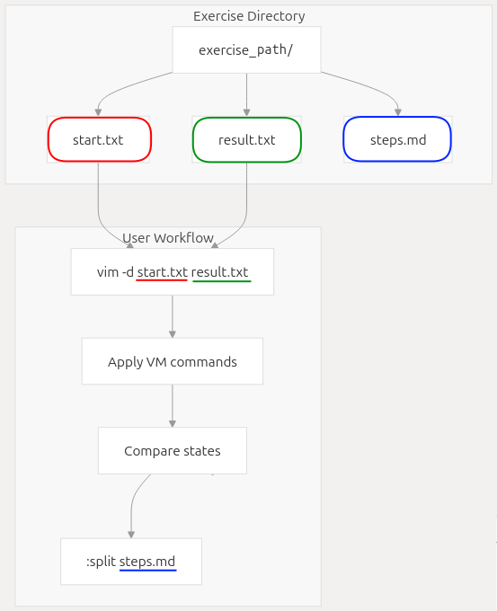
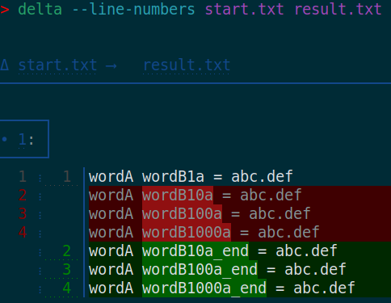
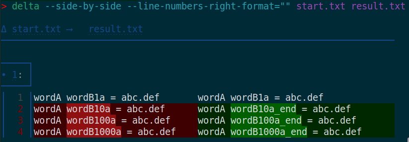
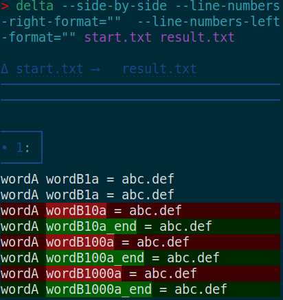

<div align="center">
  <a href="https://github.com/juanMarinero/vim-visual-multi-exercises/pulls"></a>
  <a href="https://github.com/juanMarinero/vim-visual-multi-exercises?tab=readme-ov-file#license"></a>
  
  
  <a href="https://deepwiki.com/juanMarinero/vim-visual-multi-exercises"></a>
</div>
<br/>

**Exercises** to learn [vim-visual-multi](https://github.com/mg979/vim-visual-multi).

A complement to the official [tutorial](https://github.com/mg979/vim-visual-multi#tutorial).

**How to use**

0. Read [doc/visual-multi.txt](https://github.com/mg979/vim-visual-multi/blob/master/doc/visual-multi.txt) and practice with [doc/vm-tutorial](https://github.com/mg979/vim-visual-multi/blob/master/doc/vm-tutorial).
1. Read the [`C-Down`/`C-Up` to add cursors vertically](#c-downc-up-to-add-cursors-vertically) exercise to get familiar with VM (short for [vim-visual-multi](https://github.com/mg979/vim-visual-multi)). This is the most beginners-focused exercise and has screenshots.
2. [Learning by Doing](https://en.wikipedia.org/wiki/Learning-by-doing). Go to an [exercise](#exercises) and try to solve it:
- Make the left window buffer become identical to the right one applying VM commands: `cd <this_repo>/exercises/<exercise_name> && vim -d start.txt result.txt` or directly copy-paste the command of *Start vs result* section of the desired exercise.
- To display the solution click on `▸ Solution` or use `:split steps.md`.

<div align="center">
  <a href="https://deepwiki.com/juanMarinero/vim-visual-multi-exercises/1-overview#exercise-file-structure">
    
  </a>
</div>

3. To solve the exercises more programmatly read the [Transpose programmatly](#transpose-programmatly) exercise as example.
4. All collaboration is appreciated: [contribute](#contribute).

<a id="avoid_VM_wiki"></a>**Avoid VM wiki, embrace `:help vm-`**

Use `:help vm-quick-reference` or alike to read the up-to-date VM own documentation. The [wiki](https://github.com/mg979/vim-visual-multi/wiki) will be kept for screenshots but consider it outdated for everything else.

**leader- vs \\\\**

`leader-` is your `g:VM_leader` (default `\\`)
- In section's headers it appears as `leader-` instead of `\\` because one might not use the default `g:VM_leader`.
- But the other way around in solutions to make it easier to understand (and apply) for Vim-beginners. Also to not confuse with Vim-mapleader (see `:help mapleader`).

<a id="exercises"></a>**Exercises**

* [`C-Down`/`C-Up` to add cursors vertically](#c-downc-up-to-add-cursors-vertically)
  * [Compare-results](#add-cursors-vertically-compare-results)
* [`leader-c` to add cursors vertically](#leader-c-to-add-cursors-vertically)
* [`Q` to remove unwanted cursors after selection](#q-to-remove-unwanted-cursors-after-selection)
* [`q` to skip cursor-region and go to next region](#q-to-skip-cursor-region-and-go-to-next-region)
* [`.` to run single repeat](#dot-to-run-single-repeat)
  * [Dot to add content](#dot-to-add-content)
  * [Dot to remove content](#dot-to-remove-content)
* [`R` to replace content of pattern](#r-to-replace-content-of-pattern)
* [`leader-\` to add cursor at position](#leader-backslash-to-add-cursor-at-position)
* [`leader-d` to duplicate regions](#leader-d-to-duplicate-regions)
* [`leader-t` to transpose](#leader-t-to-transpose)
  * [Transpose programmatly](#transpose-programmatly)
* [Rotate programmatly](#rotate-programmatly)
* [`S` to surround](#s-to-surround)
* [`C-n` in normal mode adds a word under cursor, keep pressing to find next occurrence](#c-n-in-normal-mode-adds-a-word-under-cursor-keep-pressing-to-find-next-occurrence)
* [`n` or `N` after `C-n`](#n-or-n-after-c-n)
* [ `leader-/` for regex search](#leader--for-regex-search)
* [`g/` to expand each region by search regex](#g-to-expand-each-region-by-search-regex)
* [`C-n` in visual mode adds selecting chars, keep pressing to find next occurrence](#c-n-in-visual-mode-adds-selecting-chars-keep-pressing-to-find-next-occurrence)
* [`C-n` in normal mode to add multiple regex-words](#c-n-in-normal-mode-to-add-multiple-regex-words)
* [`C-n` case sensitive vs ignore-case vs smartcase](#c-n-case-sensitive-vs-ignore-case-vs-smartcase)
  * [Case sensitive](#case-sensitive)
  * [`leader-c` to ignore-case](#leader-c-to-ignore-case)
  * [`leader-c` twice to smart-case](#leader-c-twice-to-smart-case)
* [`u`/`C-r` to undo/redo](#uc-r-to-undoredo)
* [`leader-w` to toggle whole word search](#leader-w-to-toggle-whole-word-search)
* [`leader-a` to align, `[count]leader-<` to align by char,  `leader->` to align by regex](#leader-a-to-align-the-rightmost-column-countleader--to-align-by-char--leader--to-align-by-regex)
* [`leader-C` for case conversion](#leader-c-for-case-conversion)
* [`leader-m` to merge regions](#leader-m-to-merge-regions)
* [`leader-s` to split regions](#leader-s-to-split-regions)
* [`leader-minus`/`leader-plus` to shrink/enlarge regions](#leader-minusleader-plus-to-shrinkenlarge-regions)
* [`s` for select operator](#s-for-select-operator)
* [`m` for find operator](#m-for-find-operator)
* [`leader-f` to filter regions](#leader-f-to-filter-regions)
* [`leader-n`/`leader-N` for numbering](#leader-nleader-n-for-numbering)
  * [Prepend](#numbering_prepend)
  * [Append](#numbering_append)
* [`<M-S-Arrows>` to shift text](#m-s-arrows-to-shift-text)
* [`leader-e` to transform regions with expression](#leader-e-to-transform-regions-with-expression)
* [`leader-R` to remove every n regions](#leader-r-to-remove-every-n-regions)

**Advance**

* [Special commands](#special-commands)
  * [Tools menu](#tools-menu)
  * [`<C-V>` for pasting the unnamed VM register](#c-v-for-pasting-the-unnamed-vm-register)
* [Mappings](#mappings)
  * [Default mappings](#default-mappings)
  * [Overwrite mappings](#overwrite-mappings)

**Collaboration, ToDo-s & FAQs**

* [Contribute](#contribute)
* [FAQs](#faqs)
  * [VM FAQs](#vm-faqs)
  * [Vanilla markdown is not enough? Why is NodeJS needed?](#vanilla-markdown-is-not-enough-why-is-nodejs-needed)
  * [Why is needed to display content of files instead of writting them directly on `README.md`?](#why-is-needed-to-display-content-of-files-instead-of-writting-them-directly-on-readmemd)
  * [Why does Markdown Magic process `README_magic.md` instead of `README.md`?](#why-does-markdown-magic-process-readme_magicmd-instead-of-readmemd)
  * [Troubleshooting](#troubleshooting)


## `C-Down`/`C-Up` to add cursors vertically 

`:help vm-add-cursors`

If `C-Down`/`C-Up` mappings don't work apply [overwrite mappings](#overwrite-mappings).


<details>
  <summary>Solution</summary>

<!-- doc-gen FILE src=exercises/add_cursors_vertically/steps.md -->
This content will be replaced by the local script content.
<!-- end-doc-gen -->

</details>

**Start**

<!-- doc-gen CODE src=exercises/add_cursors_vertically/start.txt -->
This content will be replaced by the local script content.
<!-- end-doc-gen -->

**Result**

<!-- doc-gen CODE src=exercises/add_cursors_vertically/result.txt -->
This content will be replaced by the local script content.
<!-- end-doc-gen -->

### <a id="add-cursors-vertically-compare-results"></a> Compare results

A. (Neo)Vimdiff. Jump with `]e` or `]b` of [diffchar.vim](https://github.com/rickhowe/diffchar.vim) to next char-diff

```sh
cd exercises/add_cursors_vertically
vim -d start.txt result.txt
```

B. [delta](https://github.com/dandavison/delta) diff. For example

<table style="table-layout: fixed;">
  <tr>
    <th style="vertical-align: middle;">Not side-by-side</td>
    <th style="vertical-align: middle;">Side-by-side</td>
    <th style="vertical-align: middle;">Side-by-side<br>Resize terminal window to show vertical diff one line of each file</td>
  </tr>
  <tr>
    <td><code>delta --line-numbers start.txt result.txt</code></td>
    <td><code>delta --side-by-side --line-numbers-right-format="" start.txt result.txt</code></td>
    <td><code>delta --side-by-side --line-numbers-right-format="" --line-numbers-left-format="" start.txt result.txt</code></td>
  </tr>
  <tr>
    <td style="vertical-align: middle; width: 35vw;"></td>
    <td style="vertical-align: middle; width: 47vw;"></td>
    <td style="vertical-align: middle; width: 22vw;"></td>
  </tr>
</table>


## `leader-c` to add cursors vertically 

`:help vm-mappings-visual`


Do **not** confuse with `leader-c` of [`C-n` case sensitive vs ignore-case vs smartcase](#c-n-case-sensitive-vs-ignore-case-vs-smartcase).


<details>
  <summary>Solution</summary>

<!-- doc-gen FILE src=exercises/add_cursors_vertically_leader_c/steps.md -->
This content will be replaced by the local script content.
<!-- end-doc-gen -->

</details>

**Start**

<!-- doc-gen CODE src=exercises/add_cursors_vertically_leader_c/start.txt -->
This content will be replaced by the local script content.
<!-- end-doc-gen -->

**Result**

<!-- doc-gen CODE src=exercises/add_cursors_vertically_leader_c/result.txt -->
This content will be replaced by the local script content.
<!-- end-doc-gen -->

**Start vs result**

```sh
cd exercises/add_cursors_vertically_leader_c
vim -d start.txt result.txt
```


## `Q` to remove unwanted cursors after selection


Map | Action | Documentation 
--|--|--
Tab | Switch between cursor and extend mode | `:help vm-modes`
n / N / q | Next/Previous/Skip | `:help vm-find-next`
Q | Remove region under cursor | `:help vm-remove-region`

<details>
  <summary>Solution</summary>

<!-- doc-gen FILE src=exercises/remove_cursors_after_selection/steps.md -->
This content will be replaced by the local script content.
<!-- end-doc-gen -->

</details>

**Start**

<!-- doc-gen CODE src=exercises/remove_cursors_after_selection/start.txt -->
This content will be replaced by the local script content.
<!-- end-doc-gen -->

**Result**

<!-- doc-gen CODE src=exercises/remove_cursors_after_selection/result.txt -->
This content will be replaced by the local script content.
<!-- end-doc-gen -->

**Start vs result**

```sh
cd exercises/remove_cursors_after_selection
vim -d start.txt result.txt
```

## `q` to skip cursor-region and go to next region

Map | Action | Documentation 
--|--|--
n / N / q | Next/Previous/Skip | `:help vm-find-next`

<details>
  <summary>Solution</summary>

<!-- doc-gen FILE src=exercises/skip_cursor_and_go_to_next/steps.md -->
This content will be replaced by the local script content.
<!-- end-doc-gen -->

</details>

**Start**

<!-- doc-gen CODE src=exercises/skip_cursor_and_go_to_next/start.txt -->
This content will be replaced by the local script content.
<!-- end-doc-gen -->

**Result**

<!-- doc-gen CODE src=exercises/skip_cursor_and_go_to_next/result.txt -->
This content will be replaced by the local script content.
<!-- end-doc-gen -->

**Start vs result**

```sh
cd exercises/skip_cursor_and_go_to_next
vim -d start.txt result.txt
```

## <a id="dot-to-run-single-repeat"></a>`.` to run single repeat

`:help vm-run-dot`

Next exercises are very close to those of [doc/vm-tutorial](https://github.com/mg979/vim-visual-multi/blob/master/doc/vm-tutorial) dot-section: `vim <path>/vim-visual-multi/doc/vm-tutorial -c '/Dot \~'`.


### Dot to add content

<details>
  <summary>Solution</summary>

<!-- doc-gen FILE src=exercises/dot_add_content/steps.md -->
this content will be replaced by the local script content.
<!-- end-doc-gen -->

</details>

**Start**

<!-- doc-gen CODE src=exercises/dot_add_content/start.txt -->
this content will be replaced by the local script content.
<!-- end-doc-gen -->

**Result**

<!-- doc-gen CODE src=exercises/dot_add_content/result.txt -->
this content will be replaced by the local script content.
<!-- end-doc-gen -->

**Start vs result**

```sh
cd exercises/dot_add_content
vim -d start.txt result.txt
```

### Dot to remove content

<details>
  <summary>Solution</summary>

<!-- doc-gen FILE src=exercises/dot_remove_content/steps.md -->
this content will be replaced by the local script content.
<!-- end-doc-gen -->

</details>

**Start**

<!-- doc-gen CODE src=exercises/dot_remove_content/start.txt -->
this content will be replaced by the local script content.
<!-- end-doc-gen -->

**Result**

<!-- doc-gen CODE src=exercises/dot_remove_content/result.txt -->
this content will be replaced by the local script content.
<!-- end-doc-gen -->

**Start vs result**

```sh
cd exercises/dot_remove_content
vim -d start.txt result.txt
```

## `R` to replace content of pattern

`:help vm-replace-pattern`

Next exercises are almost identical to those of [doc/vm-tutorial](https://github.com/mg979/vim-visual-multi/blob/master/doc/vm-tutorial): `vim <path>/vim-visual-multi/doc/vm-tutorial -c '/Replace in regions, Select Operator \~'`.


<details>
  <summary>Solution</summary>

<!-- doc-gen FILE src=exercises/replace_pattern/steps.md -->
this content will be replaced by the local script content.
<!-- end-doc-gen -->

</details>

**Start**

<!-- doc-gen CODE src=exercises/replace_pattern/start.txt -->
this content will be replaced by the local script content.
<!-- end-doc-gen -->

**Result**

<!-- doc-gen CODE src=exercises/replace_pattern/result.txt -->
this content will be replaced by the local script content.
<!-- end-doc-gen -->

**Start vs result**

```sh
cd exercises/replace_pattern
vim -d start.txt result.txt
```


### <a id="replace_pattern_bonus"></a>Bonus

<details>
  <summary>Solution</summary>

<!-- doc-gen FILE src=exercises/replace_pattern_02/steps.md -->
this content will be replaced by the local script content.
<!-- end-doc-gen -->

</details>

**Start**

<!-- doc-gen CODE src=exercises/replace_pattern_02/start.txt -->
this content will be replaced by the local script content.
<!-- end-doc-gen -->

**Result**

<!-- doc-gen CODE src=exercises/replace_pattern_02/result.txt -->
this content will be replaced by the local script content.
<!-- end-doc-gen -->

**Start vs result**

```sh
cd exercises/replace_pattern_02
vim -d start.txt result.txt
```


## <a id="leader-backslash-to-add-cursor-at-position"></a>`leader-\` to add cursor at position

`:help vm-add-cursor`

<details>
  <summary>Solution</summary>

<!-- doc-gen FILE src=exercises/add_cursor_at_position/steps.md -->
This content will be replaced by the local script content.
<!-- end-doc-gen -->

</details>

**Start**

<!-- doc-gen CODE src=exercises/add_cursor_at_position/start.txt -->
This content will be replaced by the local script content.
<!-- end-doc-gen -->

**Result**

<!-- doc-gen CODE src=exercises/add_cursor_at_position/result.txt -->
This content will be replaced by the local script content.
<!-- end-doc-gen -->

**Start vs result**

```sh
cd exercises/add_cursor_at_position
vim -d start.txt result.txt
```

Bonus

<details>
  <summary>Solution</summary>

<!-- doc-gen FILE src=exercises/add_cursor_at_position_02/steps.md -->
This content will be replaced by the local script content.
<!-- end-doc-gen -->

</details>

**Result**

<!-- doc-gen CODE src=exercises/add_cursor_at_position_02/result.txt -->
This content will be replaced by the local script content.
<!-- end-doc-gen -->

**Start vs result**

```sh
cd exercises/add_cursor_at_position_02
vim -d start.txt result.txt
```


## `leader-d` to duplicate regions

`:help vm-duplicate`

<details>
  <summary>Solution</summary>

<!-- doc-gen FILE src=exercises/regions_duplicate/steps.md -->
This content will be replaced by the local script content.
<!-- end-doc-gen -->

</details>

**Start**

<!-- doc-gen CODE src=exercises/regions_duplicate/start.txt -->
This content will be replaced by the local script content.
<!-- end-doc-gen -->

**Result**

<!-- doc-gen CODE src=exercises/regions_duplicate/result.txt -->
This content will be replaced by the local script content.
<!-- end-doc-gen -->

**Start vs result**

```sh
cd exercises/regions_duplicate
vim -d start.txt result.txt
```


## `leader-t` to transpose

`:help vm-transpose`

See GIF of [wiki/Special-commands#text-transposition](https://github.com/mg979/vim-visual-multi/wiki/Special-commands#text-transposition).

<details>
  <summary>Solution</summary>

<!-- doc-gen FILE src=exercises/regions_transpose/steps.md -->
This content will be replaced by the local script content.
<!-- end-doc-gen -->

</details>

**Start**

<!-- doc-gen CODE src=exercises/regions_transpose/start.txt -->
This content will be replaced by the local script content.
<!-- end-doc-gen -->

Result of apply transpose once

<!-- doc-gen CODE src=exercises/regions_transpose/result.txt -->
This content will be replaced by the local script content.
<!-- end-doc-gen -->

Result of apply transpose twice

<!-- doc-gen CODE src=exercises/regions_transpose/result_apply_2-times.txt -->
This content will be replaced by the local script content.
<!-- end-doc-gen -->

Start vs results

```sh
cd exercises/regions_transpose
vim -d start.txt result.txt result_apply_2-times.txt
```

### Transpose programmatly

`:help vm-transpose`

<details>
  <summary>Solution</summary>

<!-- doc-gen FILE src=exercises/regions_transpose_02/steps.md -->
This content will be replaced by the local script content.
<!-- end-doc-gen -->

</details>

**Start**

<!-- doc-gen CODE src=exercises/regions_transpose_02/start.txt -->
This content will be replaced by the local script content.
<!-- end-doc-gen -->

**Result**

<!-- doc-gen CODE src=exercises/regions_transpose_02/result.txt -->
This content will be replaced by the local script content.
<!-- end-doc-gen -->

Start vs results

```sh
cd exercises/regions_transpose_02
vim -d start.txt result.txt
```

## Rotate programmatly

Recommended to previous understand the [transpose programmatly](#transpose-programmatly) exercise.

There is no oficial `:help `. Proof me wrong please

```
cd <path>/vim-visual-multi/doc
rg rotate
```

[autoload/vm/maps/all.vim](https://github.com/mg979/vim-visual-multi/blob/master/autoload/vm/maps/all.vim) says:

> \"Rotate":                  ['',          'n'],

...thus there is no default mapping to rotate. 

[autoload/vm/plugs.vim](https://github.com/mg979/vim-visual-multi/blob/master/autoload/vm/plugs.vim) says:

```vim
nnoremap <silent> <Plug>(VM-Rotate) :call b:VM_Selection.Edit.rotate()<cr>
```

Thus we can

- Run `:call b:VM_Selection.Edit.rotate()`
- Run `:execute "normal \<Plug>(VM-Rotate)"`
- Create a mapping, for example: `let g:VM_maps['Rotate']   = '\\B'`. Try to use a key that is not already used. Search `leader-<key>` in [autoload/vm/maps/all.vim](https://github.com/mg979/vim-visual-multi/blob/master/autoload/vm/maps/all.vim)


<details>
  <summary>Solution</summary>

<!-- doc-gen FILE src=exercises/regions_rotate/steps.md -->
This content will be replaced by the local script content.
<!-- end-doc-gen -->

</details>

**Start**

<!-- doc-gen CODE src=exercises/regions_rotate/start.txt -->
This content will be replaced by the local script content.
<!-- end-doc-gen -->

**Result**

<!-- doc-gen CODE src=exercises/regions_rotate/result.txt -->
This content will be replaced by the local script content.
<!-- end-doc-gen -->

Start vs results

```
cd exercises/regions_rotate
vim -d start.txt result.txt
```


## `S` to surround

`:help vm-mappings-buffer` and `:help vm-extend-mode` say:
- [vim-surround](https://github.com/tpope/vim-surround) plugin is required 
- This command is specific to extend-mode

`:help vm-operators` quote

> |vim-surround|      example: `ysiw(` to enclose in parentheses

<details>
  <summary>Solution</summary>

<!-- doc-gen FILE src=exercises/regions_surround/steps.md -->
This content will be replaced by the local script content.
<!-- end-doc-gen -->

</details>

**Start**

<!-- doc-gen CODE src=exercises/regions_surround/start.txt -->
This content will be replaced by the local script content.
<!-- end-doc-gen -->

**Result**

<!-- doc-gen CODE src=exercises/regions_surround/result.txt -->
This content will be replaced by the local script content.
<!-- end-doc-gen -->

**Start vs result**

```sh
cd exercises/regions_surround
vim -d start.txt result.txt
```

## `C-n` in normal mode adds a word under cursor, keep pressing to find next occurrence

`:help vm-find-word`. `:help vm-mappings-qr` summarizes it, but does not mention counts, quote:

```
Find Under            <C-n>       select the word under cursor
Find Subword Under    <C-n>       from visual mode, without word boundaries
```

Remember the [avoid VM wiki](avoid_VM_wiki) section: the [VM wiki](https://github.com/mg979/vim-visual-multi/wiki) will be kept for screenshots but consider it outdated for everything else. Though `C-n` content is up-to-date. [wiki/Quick-start#select-word-or-subword-under-cursor](https://github.com/mg979/vim-visual-multi/wiki/Quick-start#select-word-or-subword-under-cursor) quotes:

> The basic mapping is C-n, it works from normal mode (selecting a whole word) or visual mode (selecting characters, without word boundaries)
>
> `C-n` will select a word with word boundaries, unless pressed on an existing selection. Also note that if you move to a different word with arrow keys and press `C-n` again, a new pattern will be added, and all of them will be searched when pressing `n`.

For programmatly solving, like in [Transpose programmatly](#transpose-programmatly), notice [autoload/vm/plugs.vim](https://github.com/mg979/vim-visual-multi/blob/master/autoload/vm/plugs.vim):

```
nnoremap <silent>       <Plug>(VM-Find-Under)              :<c-u>call vm#commands#ctrln(v:count1)<cr>
xnoremap <silent><expr> <Plug>(VM-Find-Subword-Under)      <sid>Visual('under')
```

<details>
  <summary>Solution</summary>

<!-- doc-gen FILE src=exercises/add_word_under_cursor/steps.md -->
This content will be replaced by the local script content.
<!-- end-doc-gen -->

</details>

**Start**

<!-- doc-gen CODE src=exercises/add_word_under_cursor/start.txt -->
This content will be replaced by the local script content.
<!-- end-doc-gen -->

**Result**

<!-- doc-gen CODE src=exercises/add_word_under_cursor/result.txt -->
This content will be replaced by the local script content.
<!-- end-doc-gen -->

**Start vs result**

```sh
cd exercises/add_word_under_cursor
vim -d start.txt result.txt
```

## `n` or `N` after `C-n`

`:help vm-find-word` quote:

```
n            find next
N            find previous
```

`:help vm-regex-search` quote:

> Pressing `n/N` will then find the next occurrence of that pattern, rather than the word under cursor.

[wiki/Quick-start#select-word-or-subword-under-cursor](https://github.com/mg979/vim-visual-multi/wiki/Quick-start#select-word-or-subword-under-cursor) says:

> Once VM is active, you can press `n` to get the next occurrence, `N` to get the previous one.

In previous [section](#c-n-in-normal-mode-adds-a-word-under-cursor-keep-pressing-to-find-next-occurrence) we combined `C-n` to add regions and `q` to skip and jump to next. Now we aim the same result using `Q` to remove regions and  `n`/`N` to move to next/previous region.

<details>
  <summary>Solution</summary>

<!-- doc-gen FILE src=exercises/add_word_under_cursor_N_and_n/steps.md -->
This content will be replaced by the local script content.
<!-- end-doc-gen -->

</details>

**Start**

<!-- doc-gen CODE src=exercises/add_word_under_cursor_N_and_n/start.txt -->
This content will be replaced by the local script content.
<!-- end-doc-gen -->

**Result**

<!-- doc-gen CODE src=exercises/add_word_under_cursor_N_and_n/result.txt -->
This content will be replaced by the local script content.
<!-- end-doc-gen -->

**Start vs result**

```sh
cd exercises/add_word_under_cursor_N_and_n
vim -d start.txt result.txt
```


## `leader-/` for regex search

`:help vm-regex-search`

<details>
  <summary>Solution</summary>

<!-- doc-gen FILE src=exercises/add_cursor_regex_search/steps.md -->
This content will be replaced by the local script content.
<!-- end-doc-gen -->

</details>

**Start**

<!-- doc-gen CODE src=exercises/add_cursor_regex_search/start.txt -->
This content will be replaced by the local script content.
<!-- end-doc-gen -->

**Result**

<!-- doc-gen CODE src=exercises/add_cursor_regex_search/result.txt -->
This content will be replaced by the local script content.
<!-- end-doc-gen -->

**Start vs result**

```sh
cd exercises/add_cursor_regex_search
vim -d start.txt result.txt
```


## `g/` to expand each region by search regex 

`:help vm-slash`

<details>
  <summary>Solution</summary>

<!-- doc-gen FILE src=exercises/regions_expand_to_regex_search/steps.md -->
This content will be replaced by the local script content.
<!-- end-doc-gen -->

</details>

**Start**

<!-- doc-gen CODE src=exercises/regions_expand_to_regex_search/start.txt -->
This content will be replaced by the local script content.
<!-- end-doc-gen -->

**Result**

<!-- doc-gen CODE src=exercises/regions_expand_to_regex_search/result.txt -->
This content will be replaced by the local script content.
<!-- end-doc-gen -->

**Start vs result**

```sh
cd exercises/regions_expand_to_regex_search
vim -d start.txt result.txt
```


## `C-n` in visual mode adds selecting chars, keep pressing to find next occurrence

Read `:help ` commands of section [`C-n` in normal mode adds a word under cursor, keep pressing to find next occurrence](#c-n-in-normal-mode-adds-a-word-under-cursor-keep-pressing-to-find-next-occurrence).

<details>
  <summary>Solution</summary>

<!-- doc-gen FILE src=exercises/add_chars_visual_selected/steps.md -->
This content will be replaced by the local script content.
<!-- end-doc-gen -->

</details>

**Start**

<!-- doc-gen CODE src=exercises/add_chars_visual_selected/start.txt -->
This content will be replaced by the local script content.
<!-- end-doc-gen -->

**Result**

<!-- doc-gen CODE src=exercises/add_chars_visual_selected/result.txt -->
This content will be replaced by the local script content.
<!-- end-doc-gen -->

**Start vs result**

```sh
cd exercises/add_chars_visual_selected
vim -d start.txt result.txt
```


## `C-n` in normal mode to add multiple regex-words

Read `:help ` commands of section [`C-n` in normal mode adds a word under cursor, keep pressing to find next occurrence](#c-n-in-normal-mode-adds-a-word-under-cursor-keep-pressing-to-find-next-occurrence).

<details>
  <summary>Solution</summary>

<!-- doc-gen FILE src=exercises/add_word_under_cursor_multiple_regex/steps.md -->
This content will be replaced by the local script content.
<!-- end-doc-gen -->

</details>

**Start**

<!-- doc-gen CODE src=exercises/add_word_under_cursor_multiple_regex/start.txt -->
This content will be replaced by the local script content.
<!-- end-doc-gen -->

**Result**

<!-- doc-gen CODE src=exercises/add_word_under_cursor_multiple_regex/result.txt -->
This content will be replaced by the local script content.
<!-- end-doc-gen -->

**Start vs result**

```sh
cd exercises/add_word_under_cursor_multiple_regex
vim -d start.txt result.txt
```

## `C-n` case sensitive vs ignore-case vs smartcase

`:help g:VM_case_setting`

[doc/vm-tutorial](https://github.com/mg979/vim-visual-multi/blob/master/doc/vm-tutorial) explains it:

> Press `\\c`: this allows you to cycle the case setting of the current pattern. Press it until it becomes case insensitive.

and actually it show how to use it several times:

```sh
cd <path>/vim-visual-multi/doc
rg --smart-case '\\c' vm-tutorial
rg --case-sensitive '\\\\c' vm-tutorial # if shell interprets backslashes as escape characters
```

For a programmatly approach check [wiki/5.-Operators#smart-case-change](https://github.com/mg979/vim-visual-multi/wiki/5.-Operators#smart-case-change).

Do **not** confuse with [`leader-c` to add cursors vertically](#leader-c-to-add-cursors-vertically).


### Case sensitive

Case sensitive is default.

<details>
  <summary>Solution</summary>

<!-- doc-gen FILE src=exercises/case_sensitive/steps.md -->
This content will be replaced by the local script content.
<!-- end-doc-gen -->

</details>

**Start**

<!-- doc-gen CODE src=exercises/case_sensitive/start.txt -->
This content will be replaced by the local script content.
<!-- end-doc-gen -->

**Result**

<!-- doc-gen CODE src=exercises/case_sensitive/result.txt -->
This content will be replaced by the local script content.
<!-- end-doc-gen -->

**Start vs result**

```sh
cd exercises/case_sensitive
vim -d start.txt result.txt
```

### `leader-c` to ignore-case

<details>
  <summary>Solution</summary>

<!-- doc-gen FILE src=exercises/case_ignore/steps.md -->
This content will be replaced by the local script content.
<!-- end-doc-gen -->

</details>

**Start**

<!-- doc-gen CODE src=exercises/case_ignore/start.txt -->
This content will be replaced by the local script content.
<!-- end-doc-gen -->

**Result**

<!-- doc-gen CODE src=exercises/case_ignore/result.txt -->
This content will be replaced by the local script content.
<!-- end-doc-gen -->

**Start vs result**

```sh
cd exercises/case_ignore
vim -d start.txt result.txt
```


### `leader-c` twice to smart-case

Smart Case: searches are case insensitive unless the search pattern contains an uppercase letter, in which case it becomes case sensitive.

For extend mode read `:help vm-smart-case-change`.

<details>
  <summary>Solution</summary>

<!-- doc-gen FILE src=exercises/case_smart/steps.md -->
This content will be replaced by the local script content.
<!-- end-doc-gen -->

</details>

**Start**

<!-- doc-gen CODE src=exercises/case_smart/start.txt -->
This content will be replaced by the local script content.
<!-- end-doc-gen -->

**Result**

<!-- doc-gen CODE src=exercises/case_smart/result.txt -->
This content will be replaced by the local script content.
<!-- end-doc-gen -->

**Start vs result**

```sh
cd exercises/case_smart
vim -d start.txt result.txt
```

## `u`/`C-r` to undo/redo

`:help vm-undo-redo`, `:help g:VM_maps` and [tutorialrc](https://github.com/mg979/vim-visual-multi/blob/master/tutorialrc) repeat that:

```
To enable undo/redo (still experimental):

    let g:VM_maps["Undo"] = 'u'
    let g:VM_maps["Redo"] = '<C-r>'
```

Thus this mappings should be added.

[doc/vm-tutorial](https://github.com/mg979/vim-visual-multi/blob/master/doc/vm-tutorial) shows how to use it several times:

```sh
cd <path>/vim-visual-multi/doc
rg --case-sensitive -e 'undo' -e 'redo' vm-tutorial
```

See also the GIF of [wiki/Quick-start#undoredo](https://github.com/mg979/vim-visual-multi/wiki/Quick-start#undoredo).


## `leader-w` to toggle whole word search

`:help vm-mappings-buffer` quote:

> Toggle Whole Word     \\w         toggle whole word search

<details>
  <summary>Solution</summary>

<!-- doc-gen FILE src=exercises/toggle_whole_word_search/steps.md -->
this content will be replaced by the local script content.
<!-- end-doc-gen -->

</details>

**Start**

<!-- doc-gen CODE src=exercises/toggle_whole_word_search/start.txt -->
this content will be replaced by the local script content.
<!-- end-doc-gen -->

**Result**

<!-- doc-gen CODE src=exercises/toggle_whole_word_search/result.txt -->
this content will be replaced by the local script content.
<!-- end-doc-gen -->

result if step 3 (toggle whole word search) is skipped (and actually `n` is pressed just once cause no more matches in those 2 lines)

<!-- doc-gen CODE src=exercises/toggle_whole_word_search/result_02.txt -->
this content will be replaced by the local script content.
<!-- end-doc-gen -->

**Start vs result**

```sh
cd exercises/toggle_whole_word_search
vim -d start.txt result.txt result_02.txt
```

## `leader-a` to align the rightmost column, `[count]leader-<` to align by char,  `leader->` to align by regex

`:help vm-align`

Read the [doc/vm-tutorial](https://github.com/mg979/vim-visual-multi/blob/master/doc/vm-tutorial) specific section: `vim <path>/vim-visual-multi/doc/vm-tutorial -c '/Alignment \~'`.
Here `[count]\\<` (to align with 1 char) and `\\>` (to align by regex pattern) are explained too.

See GIF of [wiki/Special-commands#align](https://github.com/mg979/vim-visual-multi/wiki/Special-commands#align).

<details>
  <summary>Solution</summary>

<!-- doc-gen FILE src=exercises/align/steps.md -->
This content will be replaced by the local script content.
<!-- end-doc-gen -->

</details>

**Start**

<!-- doc-gen CODE src=exercises/align/start.txt -->
This content will be replaced by the local script content.
<!-- end-doc-gen -->

**Result**

<!-- doc-gen CODE src=exercises/align/result.txt -->
This content will be replaced by the local script content.
<!-- end-doc-gen -->

**Start vs result**

```sh
cd exercises/align
vim -d start.txt result.txt
```


## `leader-C` for case conversion

`:help vm-case-conversion` explains:

Letter in the prompt | Meaning | Description
-- | -- | --
u | lowercase | Converts all letters to lowercase.
U | UPPERCASE | Converts all letters to uppercase.
C | Capitalize | Capitalizes the first letter of each word.
t | Title Case | Capitalizes the first letter of each significant word.
c | camelCase | First word lowercase, subsequent words capitalized.
P | PascalCase | All words capitalized.
s | snake_case | All lowercase, words separated by underscores.
S | SNAKE_UPPERCASE | All uppercase, words separated by underscores.
`-` | dash-case | All lowercase, words separated by hyphens.
`.` | dot.case | All lowercase, words separated by dots.
`<space>` | space case | All lowercase, words separated by spaces.


<details>
  <summary>Solution</summary>

<!-- doc-gen FILE src=exercises/case_conversion/steps.md -->
This content will be replaced by the local script content.
<!-- end-doc-gen -->

</details>

**Start**

<!-- doc-gen CODE src=exercises/case_conversion/start.txt -->
This content will be replaced by the local script content.
<!-- end-doc-gen -->

**Result**

<!-- doc-gen CODE src=exercises/case_conversion/result.txt -->
This content will be replaced by the local script content.
<!-- end-doc-gen -->

**Start vs result**

```sh
cd exercises/case_conversion
vim -d start.txt result.txt
```


## `leader-m` to merge regions

`:help vm-mappings-buffer` quote:

> Merge Regions         \\m         merge overlapping regions

[#242](https://github.com/mg979/vim-visual-multi/issues/242) says

> \\m (merge regions) works from normal mode, not from visual mode. It merges overlapping regions, not simply adjacent ones.

Here we will deal with *regions_contents*. They are:
- What text is currently selected/active in each region
- The actual editable content you can modify

<details>
  <summary>Solution</summary>

<!-- doc-gen FILE src=exercises/regions_merge/steps.md -->
This content will be replaced by the local script content.
<!-- end-doc-gen -->

</details>

**Start**

<!-- doc-gen CODE src=exercises/regions_merge/start.txt -->
This content will be replaced by the local script content.
<!-- end-doc-gen -->

**Result**

<!-- doc-gen CODE src=exercises/regions_merge/result.txt -->
This content will be replaced by the local script content.
<!-- end-doc-gen -->

**Start vs result**

```sh
cd exercises/regions_merge
vim -d start.txt result.txt
```


## `leader-s` to split regions

`:help vm-subtract-pattern`

`:help vm-extend-mode` indicates that this command is specific to extend-mode.

<details>
  <summary>Solution</summary>

<!-- doc-gen FILE src=exercises/regions_split/steps.md -->
This content will be replaced by the local script content.
<!-- end-doc-gen -->

</details>

**Start**

<!-- doc-gen CODE src=exercises/regions_split/start.txt -->
This content will be replaced by the local script content.
<!-- end-doc-gen -->

**Result**

<!-- doc-gen CODE src=exercises/regions_split/result.txt -->
This content will be replaced by the local script content.
<!-- end-doc-gen -->

**Start vs result**

```sh
cd exercises/regions_split
vim -d start.txt result.txt
```


## `leader-minus`/`leader-plus` to shrink/enlarge regions

`:help vm-mappings-buffer`:

```
Shrink   \\-  reduce regions from the sides
Enlarge  \\+  enlarge regions from the sides
```


[autoload/vm/plugs.vim](https://github.com/mg979/vim-visual-multi/blob/master/autoload/vm/plugs.vim) says:

```vim
nnoremap <silent>  <Plug>(VM-Shrink)  :call vm#commands#shrink_or_enlarge(1)<cr>
nnoremap <silent>  <Plug>(VM-Enlarge) :call vm#commands#shrink_or_enlarge(0)<cr>
```

<details>
  <summary>Solution</summary>

<!-- doc-gen FILE src=exercises/regions_shrink/steps.md -->
This content will be replaced by the local script content.
<!-- end-doc-gen -->

</details>

**Start**

<!-- doc-gen CODE src=exercises/regions_shrink/start.txt -->
This content will be replaced by the local script content.
<!-- end-doc-gen -->

**Result**

<!-- doc-gen CODE src=exercises/regions_shrink/result.txt -->
This content will be replaced by the local script content.
<!-- end-doc-gen -->

**Start vs result**

```sh
cd exercises/regions_shrink
vim -d start.txt result.txt
```


## `s` for select operator

`:help vm-select-operator`

Check
- The [bonus exercise of replace pattern](#replace_pattern_bonus)
- The GIF of [wiki/5.-Operators#select-operator](https://github.com/mg979/vim-visual-multi/wiki/5.-Operators#select-operator)


## `m` for find operator

`:help vm-find-operator`

`m` stands for matches 

<details>
  <summary>Solution</summary>

<!-- doc-gen FILE src=exercises/operator_find/steps.md -->
This content will be replaced by the local script content.
<!-- end-doc-gen -->

</details>

**Start**

<!-- doc-gen CODE src=exercises/operator_find/start.txt -->
This content will be replaced by the local script content.
<!-- end-doc-gen -->

**Result**

<!-- doc-gen CODE src=exercises/operator_find/result.txt -->
This content will be replaced by the local script content.
<!-- end-doc-gen -->

**Start vs result**

```sh
cd exercises/operator_find
vim -d start.txt result.txt
```

### Bonus

`maf` to select all occurrences inside a function.
See respective GIF of [wiki/5.-Operators](https://github.com/mg979/vim-visual-multi/wiki/5.-Operators#find-operator).


## `leader-f` to filter regions

`:help vm-filter`

See GIFs of [wiki/5.-Operators](https://github.com/mg979/vim-visual-multi/wiki/5.-Operators#find-operator)


<details>
  <summary>Solution</summary>

<!-- doc-gen FILE src=exercises/add_cursor_filter_regions/steps.md -->
This content will be replaced by the local script content.
<!-- end-doc-gen -->

</details>

**Start**

<!-- doc-gen CODE src=exercises/add_cursor_filter_regions/start.txt -->
This content will be replaced by the local script content.
<!-- end-doc-gen -->

**Result**

<!-- doc-gen CODE src=exercises/add_cursor_filter_regions/result.txt -->
This content will be replaced by the local script content.
<!-- end-doc-gen -->

**Start vs result**

```sh
cd exercises/add_cursor_filter_regions
vim -d start.txt result.txt
```


## `leader-n`/`leader-N` for numbering

`:help vm-numbering`

Expression syntax is: `start=[count]/step/separator`

Next exercises are almost identical to the `:h vm-numbering` ones.

See GIF of [wiki/Special-commands#numbering](https://github.com/mg979/vim-visual-multi/wiki/Special-commands#numbering).

### <a id="numbering_prepend"></a>Prepend

<details>
  <summary>Solution</summary>

<!-- doc-gen FILE src=exercises/numbering_prepend/steps.md -->
This content will be replaced by the local script content.
<!-- end-doc-gen -->

</details>

**Start**

<!-- doc-gen CODE src=exercises/numbering_prepend/start.txt -->
This content will be replaced by the local script content.
<!-- end-doc-gen -->

**Result**

<!-- doc-gen CODE src=exercises/numbering_prepend/result.txt -->
This content will be replaced by the local script content.
<!-- end-doc-gen -->

**Start vs result**

```sh
cd exercises/numbering_prepend
vim -d start.txt result.txt
```


### <a id="numbering_append"></a>Append

<details>
  <summary>Solution</summary>

<!-- doc-gen FILE src=exercises/numbering_append/steps.md -->
This content will be replaced by the local script content.
<!-- end-doc-gen -->

</details>

**Start**

<!-- doc-gen CODE src=exercises/numbering_append/start.txt -->
This content will be replaced by the local script content.
<!-- end-doc-gen -->

**Result**

<!-- doc-gen CODE src=exercises/numbering_append/result.txt -->
This content will be replaced by the local script content.
<!-- end-doc-gen -->

**Start vs result**

```sh
cd exercises/numbering_append
vim -d start.txt result.txt
```

## `<M-S-Arrows>` to shift text

`:help vm-shifting`

`<M-S-Arrows>` where `<M>` is the `Meta` key (usually `Alt` in Linux and Windows).

See GIF of [wiki/Special-commands#text-shifting](https://github.com/mg979/vim-visual-multi/wiki/Special-commands#text-shifting)

<details>
  <summary>Solution</summary>

<!-- doc-gen FILE src=exercises/regions_shift/steps.md -->
This content will be replaced by the local script content.
<!-- end-doc-gen -->

</details>

**Start**

<!-- doc-gen CODE src=exercises/regions_shift/start.txt -->
This content will be replaced by the local script content.
<!-- end-doc-gen -->

**Result**

<!-- doc-gen CODE src=exercises/regions_shift/result.txt -->
This content will be replaced by the local script content.
<!-- end-doc-gen -->

**Start vs result**

```sh
cd exercises/regions_shift
vim -d start.txt result.txt
```

## `leader-e` to transform regions with expression

`:help vm-transform`


<details>
  <summary>Solution</summary>

<!-- doc-gen FILE src=exercises/regions_transform_with_expression/steps.md -->
This content will be replaced by the local script content.
<!-- end-doc-gen -->

</details>

**Start**

<!-- doc-gen CODE src=exercises/regions_transform_with_expression/start.txt -->
This content will be replaced by the local script content.
<!-- end-doc-gen -->

**Result**

<!-- doc-gen CODE src=exercises/regions_transform_with_expression/result.txt -->
This content will be replaced by the local script content.
<!-- end-doc-gen -->

**Start vs result**

```sh
cd exercises/regions_transform_with_expression
vim -d start.txt result.txt
```

## `leader-R` to remove every n regions

`:help vm-remove-every-n`

See GIF of [wiki/Special-commands#remove-every-n-regions](https://github.com/mg979/vim-visual-multi/wiki/Special-commands#remove-every-n-regions).

<details>
  <summary>Solution</summary>

<!-- doc-gen FILE src=exercises/regions_remove_every_n/steps.md -->
This content will be replaced by the local script content.
<!-- end-doc-gen -->

</details>

**Start**

<!-- doc-gen CODE src=exercises/regions_remove_every_n/start.txt -->
This content will be replaced by the local script content.
<!-- end-doc-gen -->

**Result**

<!-- doc-gen CODE src=exercises/regions_remove_every_n/result.txt -->
This content will be replaced by the local script content.
<!-- end-doc-gen -->

**Start vs result**

```sh
cd exercises/regions_remove_every_n
vim -d start.txt result.txt
```


## Special commands

### Tools menu

Do **not** confuse with `\\l` described in `:help vm-infoline`.

`:help vm-mappings-buffer` says

```
Tools Menu  \\`  filter lines to buffer, etc
```

Alternative to <code>\\\\\`</code> we can run `:call vm#special#commands#menu()`, defined in [autoload/vm/special/commands.vim](https://github.com/mg979/vim-visual-multi/blob/master/autoload/vm/special/commands.vim). This prompts the user with a menu of commands:

```
"    - Show VM registers
i    - Show regions info
f    - Filter regions by pattern or expression
l    - Filter lines with regions
r    - Regions contents to buffer
q    - Fill quickfix with regions lines
Q    - Fill quickfix with regions positions and contents
```

We can also directly access each one with its respective command. For example to show regions info we can directly run `:call b:VM_Selection.Funcs.regions_contents()`, see practical use in [`leader-minus`/`leader-plus` to shrink/enlarge regions](#leader-minusleader-plus-to-shrinkenlarge-regions).

Read also `:help vm-ex-commands`.


### `<C-v>` for pasting the unnamed VM register

Read [doc/vm-tutorial](https://github.com/mg979/vim-visual-multi/blob/master/doc/vm-tutorial): `vim <path>/vim-visual-multi/doc/vm-tutorial -c '/Some experiments \~'`. Extract:

```
About <C-v> in insert mode: it's a special VM command that will paste the content of
the unnamed VM register, if this has been filled with something.
If you pressed <C-r>{register}, this would still work, but the pasted content would
be the same for all cursors, since it would use vim (and not VM) registers.
```


## Mappings

### Default mappings

Read `:help vm-mappings-default`.

To see them run `:echo g:Vm`.
Let's make it more human-readable. Write that vim-variable in a file:

```sh
vim -c 'redir > Vm_content.txt | echo g:Vm | redir END | quit'
```

Then replace `\\` with for example a `&`  so `json.dump` can handle it.
Finally we can revert that, replacing `&&` with `leader-` (because [jq](https://github.com/jqlang/jq) cannot handle `\\`):

```sh
cat Vm_content.txt \
  | sed 's/\\/\&/g' \
  | python3 -c 'import sys, ast, json; print(json.dumps(ast.literal_eval(sys.stdin.read())))' \
  | sed 's/&&/leader-/g' \
  | jq . --indent 2 > Vm_content.json \
  && cat Vm_content.json
```

Final JSON where each `leader-` should be `\\`:

<!-- doc-gen CODE src=aux/DefaultMappings.json -->
This content will be replaced by the local JSON script content.
<!-- end-doc-gen -->


### Overwrite mappings

`:help vm-mappings-all`. Also read `:h vm-faq-mappings` and related Vim-tags sections in [doc/vm-faq.txt](https://github.com/mg979/vim-visual-multi/blob/master/doc/vm-faq.txt).

For [kitty](https://github.com/kovidgoyal/kitty) terminal the `C-Down`/`C-Up` mappings might not work. Overwrite them like in `./mappings/kitty-terminal.vim`

<!-- doc-gen CODE src=mappings/kitty-terminal.vim -->
This content will be replaced by the local vim script content.
<!-- end-doc-gen -->


## Contribute

1. Clone this repo

```sh
git clone https://github.com/juanMarinero/vim-visual-multi-exercises
cd vim-visual-multi-exercises
```

2. Install the Node.js [modules](./package.json)

```sh
nvm install  # Installs version from .nvmrc
nvm use      # Auto-switches to version from .nvmrc
npm install
```

3. Edit `README_magic.md`. For example add [local content](./aux/new-section-template.md) or [remote content](./aux/new-section-template_remote.md)

4. Run the [markdown-magic](https://github.com/DavidWells/markdown-magic) - [script](./run-magic.js) and check the result

```sh
node run-magic.js \
  && vim README.md
```

Tip: preview directly with [markdown-preview.nvim](https://github.com/iamcco/markdown-preview.nvim)

```sh
node run-magic.js \
  && vim README.md -c "MarkdownPreviewToggle"
```

5. Make a [pull request](https://github.com/juanMarinero/vim-visual-multi-exercises/pulls)

VM has many commands, next are some **ToDo**-s exercises to be added. The easiest and most practical ones are listed at the top:
- Cursor Operators as in [wiki/5.-Operators#cursor-operators](https://github.com/mg979/vim-visual-multi/wiki/5.-Operators#cursor-operators). Focus on describe limitations
- `\\gS`, see `:help vm-reselect-last`
- `:help vm-run-at-cursors`
    - `\\z` to Run Normal, see `:help vm-run-normal` and [wiki/Commands-at-cursors#normal-commands](https://github.com/mg979/vim-visual-multi/wiki/Commands-at-cursors#normal-commands)
    - `\\v` to Run Visual, see `:help vm-run-visual` and [wiki/Commands-at-cursors#visual-commands](https://github.com/mg979/vim-visual-multi/wiki/Commands-at-cursors#visual-commands)
    - `\\x` to Run Ex,  see `:help vm-run-ex` and [wiki/Commands-at-cursors#ex-commands](https://github.com/mg979/vim-visual-multi/wiki/Commands-at-cursors#ex-commands)
    - `\\@` to Run Macro see `:help vm-run-macro` and [wiki/Commands-at-cursors#macros](https://github.com/mg979/vim-visual-multi/wiki/Commands-at-cursors#macros)
    - `\\Z` to Run Last Normal, no `:help` found, defined as `:<C-u>call b:VM_Selection.Edit.run_normal(g:Vm.last_normal[0], {'count': v:count1, 'recursive': g:Vm.last_normal[1]})` in [autoload/vm/plugs.vim](https://github.com/mg979/vim-visual-multi/blob/master/autoload/vm/plugs.vim)
    - `\\V` to Run Last Visual, no `:help` found, defined as `:call b:VM_Selection.Edit.run_visual(g:Vm.last_visual[0], g:Vm.last_visual[1])` in [autoload/vm/plugs.vim](https://github.com/mg979/vim-visual-multi/blob/master/autoload/vm/plugs.vim)
    - `\\X` to Run Last Ex, no `:help` found, defined as `:<C-u>call b:VM_Selection.Edit.run_ex(g:Vm.last_ex)` in [autoload/vm/plugs.vim](https://github.com/mg979/vim-visual-multi/blob/master/autoload/vm/plugs.vim)
- `\\<CR>`, see `:help vm-single-mode`
- `M`, read `:help vm-multiline-mode` and check GIF of [wiki/4.-Motions-and-Modes](https://github.com/mg979/vim-visual-multi/wiki/4.-Motions-and-Modes#multiline-mode)
- `\\L` to run `"One Per Line"`
- `:help vm-ex-commands`
    - `:help vm-registers` exercise showing how VM-registers vary thanks to *Tools Menu* triggered with <code>\\\\\`</code> (`:help vm-mappings-buffer`) and `"`, or directly with  `:VMRegisters`
    - `:help VMDebug`, `:help VMClear`, `:help VMSearch`, etc.


## FAQs


### VM FAQs

Run `:help vm-faqs` or open [doc/vm-faq.txt](https://github.com/mg979/vim-visual-multi/blob/master/doc/vm-faq.txt).


### Vanilla markdown is not enough? Why is NodeJS needed?

Markdowns can**not** show scripts (nor remote nor local). 
[markdown-magic](https://github.com/DavidWells/markdown-magic) comes to rescue, but it must be installed in a Node.js environment.

*Q*: And why not directly on a HTML script?

*A*: I believe markdowns are easier for humans to read and edit, making them better suited for collaboration. While HTML scripts with Node.js offer many features that Markdown lacks, I don't need [most of] those advanced capabilities. For this project Node.js should be limited to using [markdown-magic](https://github.com/DavidWells/markdown-magic), and perhaps a few additional modules in the future.


### Why is needed to display content of files instead of writting them directly on `README.md`?

- For easier **version control**. See [contribute](#contribute) section.
- To enable [vimdiff](https://vimdoc.sourceforge.net/htmldoc/diff.html), [git diff](https://git-scm.com/docs/git-diff), [delta](https://github.com/dandavison/delta),... or (Neo)Vimdiff plugins like [diffchar](https://github.com/rickhowe/diffchar.vim) or [fugitive](https://github.com/tpope/vim-fugitive) on initial (`start.txt`) vs final (`result.txt`) code. See next screenshots of [delta example](#add-cursors-vertically-compare-results).
- [Learning by Doing](https://en.wikipedia.org/wiki/Learning-by-doing) feature. To challenge myself I can `vim -O start.txt result.txt`, once I think that I achieved to make `start.txt`script identical to `result.txt` (applying [vim-visual-multi](https://github.com/mg979/vim-visual-multi) commands), then I can check it with `:windo diffthis` (OFF with `:windo diffoff`).  To display the solution click on `▸ Solution` or use `:split steps.md`.


### Why does Markdown Magic process `README_magic.md` instead of `README.md`?

The [contribute](#contribute) section instructs you to run the following JavaScript-[script](./run-magic.js):
 
<!-- doc-gen CODE src=run-magic.js -->
This content will be replaced by the local script content.
<!-- end-doc-gen -->

Thus content of `README_magic.md` is processed by [markdown-magic](https://github.com/DavidWells/markdown-magic), which outputs the result to `README.md`.

Next **non-existing** `--output` flag could achieve the same effect, for example: `npx markdown-magic --output README.md -- README_magic.md`.

In summary, running `npx markdown-magic README.md` would overwrite `README.md` directly, making version control more difficult.


### Troubleshooting

- `:help vm-troubleshooting`
- [VM-issues](https://github.com/mg979/vim-visual-multi/issues)


## License

<!-- doc-gen FILE src=LICENSE/LICENSE.md -->
This content will be replaced by the local script content.
<!-- end-doc-gen -->
